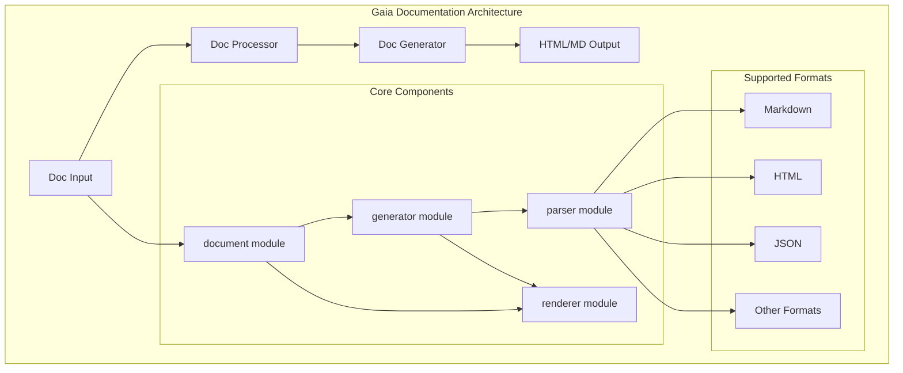
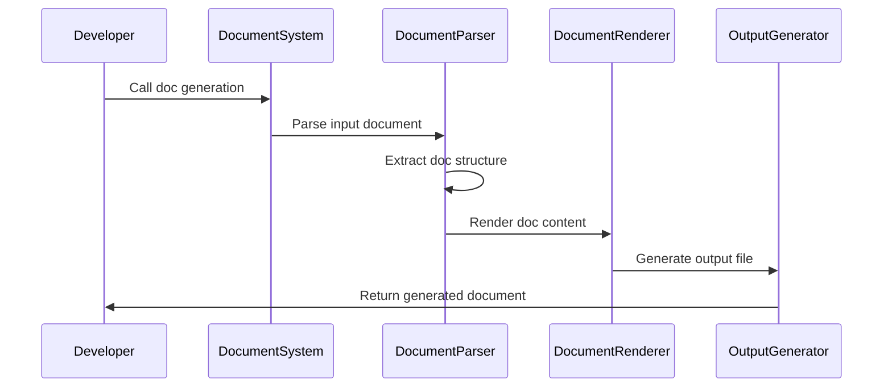

# Gaia Documentation System

[](https://opensource.org/licenses/MIT)
[](https://github.com/gaia-lang/gaia/tree/main/projects/gaia-document)

## Project Overview

Gaia Document is a complete documentation system for the Gaia project, providing comprehensive documentation support for the multi-language unified interface framework, including user guides, development documentation, and maintenance manuals.

## Architecture Overview



### Documentation Generation Flow



## Project Status

- **Development Stage**: 📚 Complete and Usable
- **Version**: 0.1.0
- **Stability**: Production Ready
- **Documentation Completeness**: High

## Core Features

### Multi-level Documentation

- User Guides and Tutorials
- Developer Documentation
- Maintenance Manuals
- API Reference Documentation

### Modern Documentation Tools

- Built on VitePress
- Responsive Design
- Search Functionality Support
- Multi-language Support

### Content Management System

- Structured Documentation Organization
- Version Control Integration
- Automated Build and Deployment
- Community Contribution Support

## Tech Stack

- **Documentation Engine**: VitePress
- **Build Tool**: Vite
- **Deployment Platforms**: GitHub Pages / Netlify
- **Code Quality**: ESLint + Prettier

## Usage

### Development Environment Setup

```bash
# Clone the repository
git clone https://github.com/gaia-lang/gaia.git
cd gaia/projects/gaia-document

# Install dependencies
npm install

# Start development server
npm run dev
```

### Building Documentation

```bash
# Build production version
npm run build

# Preview production version
npm run preview
```

### Content Contribution

```bash
# Create a new documentation page
npm run new:page -- "New Page Title"

# Check documentation links
npm run check:links

# Format documentation
npm run format
```

## Development

### Prerequisites

- Node.js 18+
- npm or yarn
- Git

### Setup

```bash
# Install dependencies
npm install

# Start development server
npm run dev

# Build production version
npm run build
```

### Contribution

1. Fork the repository
2. Create a feature branch
3. Make changes
4. Add tests if applicable
5. Submit a pull request

### Testing

```bash
# Run tests
npm test

# Run tests and generate coverage report
npm run test:coverage
```

### Deployment

```bash
# Build production version
npm run build

# Deploy to GitHub Pages
npm run deploy
```

## Documentation Structure

### User Documentation

- 📚 [Quick Start](getting-started/) - Installation and basic usage
- 📖 [User Guide](user-guide/) - Detailed usage instructions
- 🔧 [Backend Documentation](backends/) - Backend support for various platforms

### Developer Documentation

- 🔧 [Developer Guide](developer-guide/) - Extension and customization guide
- 📦 [API Reference](api-reference/) - Detailed API documentation
- 🔬 [Internal Implementation](api-reference/) - In-depth implementation details

### Maintenance Documentation

- ⚙️ [Maintenance Guide](maintenance/) - Project maintenance information

## API Reference

### Configuration API

The documentation system provides various configuration options:

- **Theme Configuration**: Customizable themes and styles
- **Navigation Structure**: Flexible navigation and sidebar configuration
- **Search Configuration**: Configurable search functionality
- **Multi-language Support**: Language-specific documentation paths

### Plugin System

The system supports various plugins to extend functionality:

- **Code Highlighting**: Multi-language syntax highlighting
- **Interactive Examples**: Real-time code execution and demonstration
- **API Documentation**: Automatic generation of API documentation from source code
- **Version Management**: Multi-version documentation support

### Deployment Options

- **Static Hosting**: Deploy to any static hosting service
- **GitHub Pages**: Direct deployment to GitHub Pages
- **Custom Domain**: Support for custom domain configuration
- **CDN Integration**: Content Delivery Network optimization

## Architecture Overview

```
Source Code → Frontend Parsing → HIR → MIR → LIR → Bytecode → VM Execution
```

### Documentation Hierarchy

```
gaia-document/
├── guide/           # User Guide
├── development/     # Development Documentation
├── maintenance/     # Maintenance Manual
├── language/        # Language Specification
├── api/            # API Reference
└── examples/       # Example Code
```

## Platform Advantages

### For Application Developers

- 🎯 **Expressive Language**: Use modern features of Valkyrie like algebraic effects
- 🚀 **High Performance**: Benefit from Gaia's advanced optimizations
- 🌐 **Deploy Anywhere**: Single codebase runs on Web, Server, and Desktop
- 🛠️ **Powerful Tooling**: Rich IDE support and debugging tools

### For Language Designers

- 🏗️ **Solid Foundation**: Built on mature virtual machine technology
- ⚡ **Performance Edge**: Get JIT compilation and optimization for free
- 🔧 **Multi-target Support**: Automatic support for multiple deployment targets
- 📊 **Analysis Tools**: Built-in performance analysis and profiling support

### For Platform Engineers

- 🔬 **Research Platform**: Experiment with new language features
- 📈 **Optimization Power**: Advanced optimization pipeline based on IR
- 🧪 **Extensibility**: Plugin architecture for custom backends
- 📚 **Comprehensive Documentation**: Extensive documentation and examples

## Community

- 💬 [Discord Community](https://discord.gg/nyar-vm)
- 🐛 [Issue Tracker](https://github.com/nyar-lang/nyar-vm/issues)
- 💡 [Discussions](https://github.com/nyar-lang/nyar-vm/discussions)
- 📧 [Mailing List](https://groups.google.com/g/nyar-vm)

## Contribution

We welcome contributions to the Gaia Assembler project! For details, please refer to:

- [Developer Guide](developer-guide/) - Development and contribution guide
- [Maintenance Guide](maintenance/) - Project maintenance information

### Development Areas

- 🔧 Assembler optimization and performance improvements
- 🌐 New compilation targets and backends
- 📚 Documentation and educational content
- 🛠️ Developer tools and IDE integration
- 🧪 Testing, benchmarking, and quality assurance

## License

This project is licensed under the MIT License.

## Acknowledgments

- Inspired by LLVM, JVM, and other successful compiler platforms
- Built with Rust to ensure memory safety and performance
- Designed for modern assembler toolchains

---

**Ready to get started with Gaia Assembler?** [Quick Start](getting-started/)
