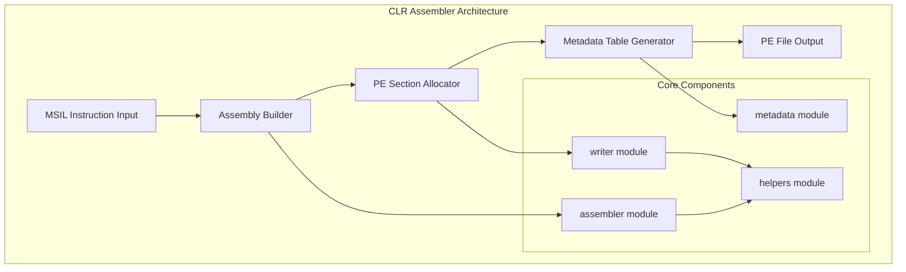
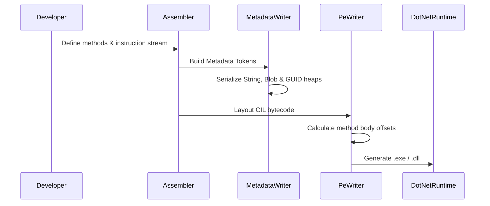

# CLR Assembler

A full-featured .NET Common Language Runtime (CLR) assembler and PE file manipulation library. It supports the entire lifecycle from instruction building to final binary generation of MSIL (Microsoft Intermediate Language).

## 🏛️ Architecture



### MSIL Compilation Workflow



## 🚀 Features

### Core Capabilities
- **Instruction Set Support**: Comprehensive coverage of the .NET Base Instruction Set and Object Model instructions.
- **Metadata Management**: Automatically constructs compressed metadata streams (#Strings, #Blob, #GUID, #US).
- **PE/COFF Construction**: Implements full PE header layout, including section alignment and optional header configurations.
- **Symbol Resolution**: Supports automatic resolution of method references, type references, and member references.

### Advanced Features
- **Exception Handling**: Supports encoding of SEH (Structured Exception Handling) clauses.
- **Strong Name Signing**: Reserved space for strong name signatures.
- **Cross-Platform Generation**: Capable of generating ECMA-335 compliant binaries on non-Windows platforms.
- **Memory Safety**: Leverages Rust's ownership model to manage the lifecycle of metadata references.

## 💻 Usage

### Generating a "Hello Gaia" Executable
The following example demonstrates how to parse MSIL source code and generate a runnable .NET executable.

```rust
use clr_assembler::formats::{
    dll::writer::DllWriter,
    msil::{converter::MsilToClrConverter, MsilLanguage, MsilBuilder},
};
use std::{fs, io::Cursor};

fn main() {
    let msil_source = r#"
        .assembly GaiaAssembler { .ver 1:0:0:0 }
        .module GaiaAssembler.exe
        .class public GaiaAssembler extends [mscorlib]System.Object {
            .method public static void Main(string[] args) cil managed {
                .entrypoint
                ldstr "Hello Gaia!"
                call void [mscorlib]System.Console::WriteLine(string)
                ret
            }
        }
    "#;

    // 1. Build AST from MSIL source
    let language = MsilLanguage::default();
    let builder = MsilBuilder::new(&language);
    let ast = builder.build(msil_source, &[], &mut Default::default()).result.unwrap();

    // 2. Convert AST to CLR Program structure
    let mut converter = MsilToClrConverter::new();
    let clr_program = converter.convert(ast).result.unwrap();

    // 3. Write to PE binary
    let mut buffer = Cursor::new(Vec::new());
    let writer = DllWriter::new(&mut buffer);
    writer.write(&clr_program).result.expect("Failed to write PE");

    let pe_data = buffer.into_inner();
    fs::write("HelloGaia.exe", pe_data).unwrap();
}
```

## 🛠️ Support Status

| Feature | Support Level | Specification |
| :--- | :---: | :--- |
| MSIL Instructions | ✅ Full | ECMA-335 Partition III |
| Metadata Tables | ✅ Full | ECMA-335 Partition II |
| Generics | ✅ Full | .NET 2.0+ |
| Exception Handling | ✅ Full | SEH / Filter Blocks |
| Resource Embedding | 🚧 Partial | .resources / Manifest |

*Legend: ✅ Supported, 🚧 In Progress, ❌ Not Supported*

## 🔗 Relations

- **[gaia-types](../../projects/gaia-types/readme.md)**: Uses `BinaryWriter` for precise layout of PE sections and metadata streams.
- **[gaia-assembler](../../projects/gaia-assembler/readme.md)**: Acts as a specialized backend for the universal assembler to generate .NET-compatible binaries from Gaia IR.
