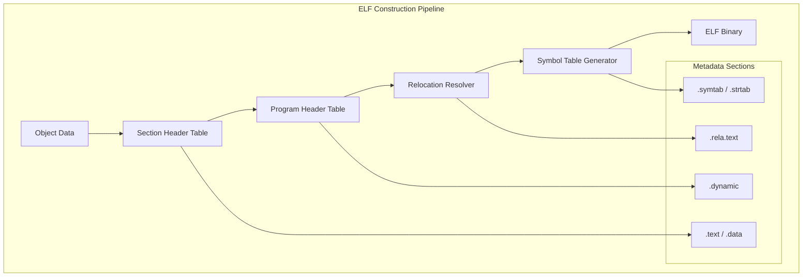

# ELF Assembler

A robust library for constructing and analyzing ELF (Executable and Linkable Format) binaries, tailored for Linux and Unix-like systems.

## 🏛️ Architecture



## 🚀 Features

### Format Integrity
- **Multi-Type Support**: Generates Relocatable files (ET_REL), Executables (ET_EXEC), and Shared Objects (ET_DYN).
- **Architecture Adaptation**: Automatically configures ELF Class (32/64 bit), Endianness, and OS ABI metadata.
- **Section Layout**: Calculates section offsets and alignment, handling serialization of the `.shstrtab` section name table.

### Core Capabilities
- **Symbol & Relocation**: Implements full symbol table mapping and relocation type processing (e.g., `R_X86_64_PC32`), supporting external symbol references.
- **Dynamic Linking**: Constructs `.dynamic` sections, configuring metadata required by dynamic loaders such as `DT_NEEDED` and `DT_SONAME`.
- **Program Header Layout**: Automatically generates `PT_LOAD` segments, managing read/write/execute permissions for memory segments.

### Advanced Features
- **Stripping**: Supports optional symbol table stripping to reduce binary size.
- **Zero-Copy Writing**: Reduces I/O pressure by pre-allocating buffers when building large binaries.

## 💻 Usage

### Generating a Simple ELF Executable
The following example demonstrates how to wrap raw x86_64 machine code into an ELF executable.

```rust
use elf_assembler::{types::ElfFile, writer::ElfWriter};
use std::{io::Cursor, fs};

fn main() {
    // 1. Prepare machine code (e.g., x86_64 exit(42))
    // mov rax, 60; mov rdi, 42; syscall
    let machine_code = vec![
        0xb8, 0x3c, 0x00, 0x00, 0x00, // mov eax, 60
        0xbf, 0x2a, 0x00, 0x00, 0x00, // mov edi, 42
        0x0f, 0x05                    // syscall
    ];

    // 2. Create ELF structure
    let elf = ElfFile::create_executable(machine_code);

    // 3. Write binary
    let mut buffer = Cursor::new(Vec::new());
    let mut writer = ElfWriter::new(&mut buffer);
    writer.write_elf_file(&elf).expect("Failed to write ELF");

    let binary = buffer.into_inner();
    fs::write("exit42", binary).expect("Failed to save file");
    
    println!("Generated ELF binary: ./exit42");
}
```

## 🛠️ Support Status

| Feature | x86_64 | ARM64 | RISC-V |
| :--- | :---: | :---: | :---: |
| ELF Header | ✅ | ✅ | ✅ |
| Program Headers | ✅ | ✅ | ✅ |
| Section Headers | ✅ | ✅ | ✅ |
| Relocations | ✅ | 🚧 | 🚧 |
| Dynamic Linking | ✅ | 🚧 | 🚧 |

*Legend: ✅ Supported, 🚧 In Progress, ❌ Not Supported*

## 🔗 Relations

- **[gaia-types](../../projects/gaia-types/readme.md)**: Utilizes the `BinaryReader` and `BinaryWriter` for structured I/O of ELF headers and tables.
- **[gaia-assembler](../../projects/gaia-assembler/readme.md)**: Provides the ELF encapsulation layer for the assembler's Linux/Unix native backends.
