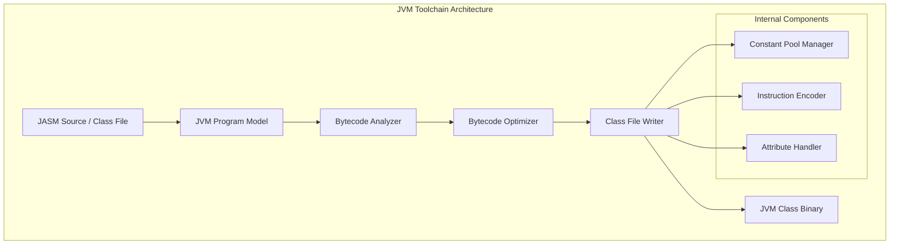

# JVM Assembler

A comprehensive Java Virtual Machine (JVM) assembler and class file manipulation library. It supports reading, analyzing, optimizing, and writing `.class` files.

## 🏛️ Architecture



## 🚀 Features

### Core Capabilities
- **Class File I/O**: High-performance reading and writing of JVM Class files (supporting Java 8 to latest versions).
- **Constant Pool Management**: Automatic management of constant pool entries, including deduplication and slot allocation for Long/Double types.
- **Bytecode Encoding**: Full support for all JVM opcodes with automatic stack map frame generation (🚧) and branch offset calculation.

### Advanced Features
- **JASM Language**: A custom assembly-like language (JASM) for human-readable JVM bytecode representation.
- **Programmatic Builder**: A fluent API for constructing classes, methods, and fields from scratch without writing raw bytecode.
- **Analysis & Optimization**: Built-in tools for control flow analysis and basic bytecode optimizations.

## 💻 Usage

### Generating a "Hello World" Class
The following example demonstrates how to build a JVM class that prints "Hello Gaia" to the console.

```rust
use jvm_assembler::program::{JvmProgram, JvmMethod, JvmInstruction, opcodes};
use jvm_assembler::formats::class::writer::ClassWriter;
use std::fs;

fn main() {
    // 1. Define instructions for the main method
    let instructions = vec![
        JvmInstruction::Getstatic("java/lang/System".into(), "out".into(), "Ljava/io/PrintStream;".into()),
        JvmInstruction::LdcString("Hello Gaia!".into()),
        JvmInstruction::Invokevirtual("java/io/PrintStream".into(), "println".into(), "(Ljava/lang/String;)V".into()),
        JvmInstruction::Return,
    ];

    // 2. Create program model
    let mut program = JvmProgram::new("HelloGaia".into());
    program.methods.push(JvmMethod::new(
        "main".into(),
        "([Ljava/lang/String;)V".into(),
        instructions,
    ));

    // 3. Write to .class file
    let mut buffer = Vec::new();
    let writer = ClassWriter::new(&mut buffer);
    writer.write(&program).result.expect("Failed to write class file");

    fs::write("HelloGaia.class", buffer).unwrap();
}
```

## 🛠️ Support Status

| Feature | Support Level | Java Version |
| :--- | :---: | :--- |
| Basic Opcodes | ✅ Full | All |
| Constant Pool | ✅ Full | All |
| Annotations | ✅ Full | Java 5+ |
| Generics | ✅ Full | Java 5+ |
| Lambdas | ✅ Full | Java 8+ |
| Stack Map Frames | 🚧 In Progress | Java 6+ |

*Legend: ✅ Supported, 🚧 In Progress, ❌ Not Supported*

## 🔗 Relations

- **[gaia-types](../../projects/gaia-types/readme.md)**: Leverages `BinaryWriter` with `BigEndian` configuration for JVM-standard bytecode serialization.
- **[gaia-assembler](../../projects/gaia-assembler/readme.md)**: Functions as the primary JVM backend, mapping Gaia IR to high-level JVM bytecode.
