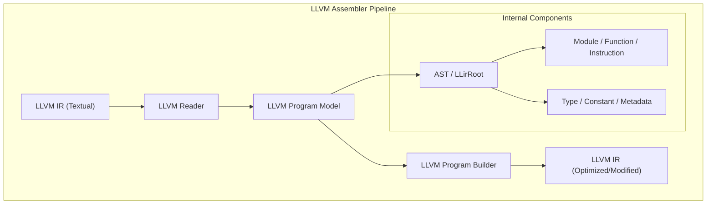

# LLVM Assembler

An LLVM IR assembler that supports converting LLVM IR into the Gaia format.

## 🏛️ Architecture



## 🚀 Features

### Core Capabilities
- **LLVM IR Parsing**: Full support for textual LLVM IR parsing into a structured AST.
- **Program Modeling**: Comprehensive model for LLVM modules, functions, and instructions.
- **Program Building**: Fluent API for constructing and modifying LLVM programs.
- **IR Generation**: Ability to emit optimized or modified LLVM IR from the program model.

### Advanced Features
- **Type System**: Support for LLVM's complex type system including pointers, arrays, and structs.
- **Metadata Management**: Handles LLVM metadata for debugging and optimization information.
- **Instruction Set**: Broad coverage of LLVM instructions from basic arithmetic to advanced control flow.

## 💻 Usage

### Parsing and Building an LLVM Program
The following example demonstrates how to read an LLVM IR string, modify it, and write it back.

```rust
use llvm_assembler::{LLvmReader, LLvmProgramBuilder, LLvmWriter};

fn main() {
    // 1. Read LLVM IR from a string
    let ir = "define i32 @main() { ret i32 0 }";
    let reader = LLvmReader::new();
    let ast = reader.read(ir).expect("Failed to parse LLVM IR");
    
    // 2. Build and modify the program
    let mut builder = LLvmProgramBuilder::new();
    let program = builder.build(ast).expect("Failed to build program");
    
    // 3. Write it back to LLVM IR
    let writer = LLvmWriter::new();
    let output_ir = writer.write(&program).expect("Failed to write LLVM IR");
    
    println!("Generated IR:\n{}", output_ir);
}
```

## 🔗 Relations

- **[gaia-types](../../projects/gaia-types/readme.md)**: Uses the base error handling and result types.
- **[gaia-assembler](../../projects/gaia-assembler/readme.md)**: Serves as a target for LLVM-based IR in the Gaia toolchain.
