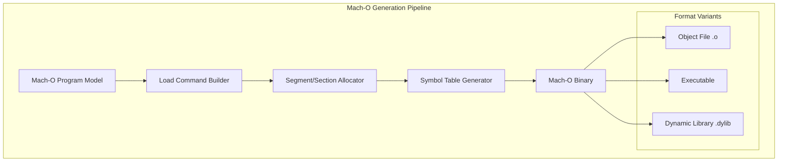

# Mach-O Assembler

A robust library for building and manipulating Mach-O (Mach Object) files, the standard executable format for macOS, iOS, and other Apple platforms.

## 🏛️ Architecture



## 🚀 Features

### Core Capabilities
- **Multi-Type Support**: Generates Mach-O Object files, Executables, and Dynamic Libraries (`.dylib`).
- **Load Command Management**: Automatically constructs essential load commands like `LC_SEGMENT_64`, `LC_SYMTAB`, `LC_DYSYMTAB`, and `LC_MAIN`.
- **Architecture Support**: Full support for `x86_64` and `arm64` (Apple Silicon) binary layouts.

### Advanced Features
- **Fat Binary Support**: Capability to bundle multiple architecture-specific Mach-O files into a single Universal Binary (🚧).
- **Symbolic Linkage**: Manages external symbols and dynamic library dependencies through `LC_LOAD_DYLIB` commands.
- **Section Alignment**: Precise control over memory alignment for text, data, and __objc sections.

## 💻 Usage

### Creating a Mach-O Dynamic Library
The following example demonstrates how to write a Mach-O program model to a `.dylib` file.

```rust
use macho_assembler::{types::MachoProgram, dylib_write_path};
use std::path::Path;

fn main() {
    // 1. Create a Mach-O program model
    let mut macho = MachoProgram::default();
    macho.header.cputype = 0x01000007; // CPU_TYPE_X86_64
    
    // 2. Define segments and symbols (omitted for brevity)
    // ...

    // 3. Write to a .dylib file using the high-level API
    let output_path = Path::new("libexample.dylib");
    dylib_write_path(&macho, output_path).expect("Failed to write dylib");
    
    println!("Successfully generated libexample.dylib");
}
```

## 🛠️ Support Status

| Platform | Object (.o) | Executable | Dylib (.dylib) | Fat Binary |
| :--- | :---: | :---: | :---: | :---: |
| macOS (x86_64) | ✅ | ✅ | ✅ | 🚧 |
| macOS (arm64) | ✅ | ✅ | ✅ | 🚧 |
| iOS | 🚧 | 🚧 | 🚧 | ❌ |

*Legend: ✅ Supported, 🚧 In Progress, ❌ Not Supported*

## 🔗 Relations

- **[gaia-types](../../projects/gaia-types/readme.md)**: Utilizes the `BinaryWriter` for precise byte-level construction of Mach-O headers and load commands.
- **[gaia-assembler](../../projects/gaia-assembler/readme.md)**: Acts as the primary Mach-O encapsulation backend for the assembler when targeting Apple platforms.
