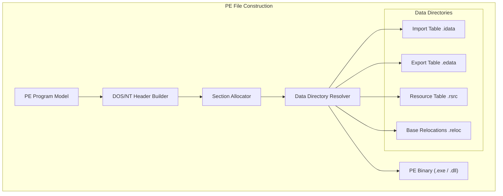

# PE Assembler

A comprehensive library for constructing and analyzing Windows Portable Executable (PE) files, covering everything from simple executables to complex dynamic libraries and debug symbols.

## 🏛️ Architecture



## 🚀 Features

### Core Capabilities
- **Format Versatility**: Supports generation of Executables (EXE), Dynamic Link Libraries (DLL), Static Libraries (LIB), and Object files (OBJ/COFF).
- **Header Management**: Precise construction of DOS stubs, PE headers (32/64 bit), and Optional headers with full data directory support.
- **Import/Export Resolution**: Automatically builds Import Address Tables (IAT) and Export Name/Ordinal tables for seamless dynamic linking.

### Advanced Features
- **Relocation Handling**: Generates base relocation blocks required for Address Space Layout Randomization (ASLR) compatibility.
- **Resource Management**: (🚧) Support for embedding icons, version information, and other manifest resources.
- **PDB Support**: (🚧) Initial framework for generating Program Database (PDB) debug information.
- **COFF Support**: Low-level access to COFF symbol tables and section relocations for static linking scenarios.

## 💻 Usage

### Generating a Windows Executable
The following example shows how to use the high-level API to write a PE program to an EXE file.

```rust
use pe_assembler::{types::PeProgram, exe_write_path};
use std::path::Path;

fn main() {
    // 1. Define a PE program model
    let mut pe = PeProgram::default();
    pe.header.machine = 0x8664; // IMAGE_FILE_MACHINE_AMD64
    
    // 2. Add sections and entry point (omitted for brevity)
    // ...

    // 3. Write to an EXE file
    let output_path = Path::new("application.exe");
    exe_write_path(&pe, output_path).expect("Failed to write EXE");
    
    println!("Successfully generated application.exe");
}
```

## 🛠️ Support Status

| Feature | Support Level | Architecture |
| :--- | :---: | :--- |
| EXE / DLL | ✅ Full | x86, x64, ARM64 |
| LIB / OBJ | ✅ Full | COFF Standard |
| Imports (IAT) | ✅ Full | Static & Delay-load |
| Exports | ✅ Full | Name & Ordinal |
| Relocations | ✅ Full | Base Reloc (Type 3/10) |
| Resources | 🚧 Partial | .rsrc section |

*Legend: ✅ Supported, 🚧 In Progress, ❌ Not Supported*

## 🔗 Relations

- **[gaia-types](../../projects/gaia-types/readme.md)**: Extensively uses the `BinaryWriter` for structured I/O of complex PE structures and alignment padding.
- **[gaia-assembler](../../projects/gaia-assembler/readme.md)**: Acts as the primary Windows-native backend for generating runnable PE binaries from Gaia IR.
- **[clr-assembler](../clr-assembler/readme.md)**: Relies on the PE foundation to wrap MSIL bytecode and .NET metadata into valid CLI-compatible PE files.
