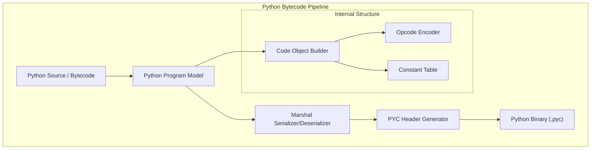

# PYC Assembler

A specialized toolchain for Python bytecode, enabling the assembly, disassembly, and manipulation of compiled Python files (`.pyc`).

## 🏛️ Architecture



## 🚀 Features

### Core Capabilities
- **Version Support**: Optimized for Python 3.x bytecode formats with support for version-specific magic numbers.
- **Marshal Format**: Full implementation of Python's `marshal` serialization protocol for complex objects like code objects, strings, and tuples.
- **Instruction Encoding**: Precise encoding of Python opcodes and their arguments, including support for extended arguments (🚧).

### Advanced Features
- **PYC Header Management**: Automatically generates valid `.pyc` headers including magic numbers, bitfield flags, and source timestamps/hash.
- **Code Object Manipulation**: High-level API for constructing and modifying `PyCodeObject` structures (co_code, co_consts, co_names, etc.).
- **Bi-directional Conversion**: Supports both reading from and writing to `.pyc` files, facilitating bytecode-level analysis and instrumentation.

## 💻 Usage

### Generating a Python Bytecode File
The following example demonstrates how to build a Python code object and save it as a `.pyc` file.

```rust
use pyc_assembler::program::PyProgram;
use pyc_assembler::formats::pyc::writer::PycWriter;
use std::fs::File;

fn main() {
    // 1. Define a Python program model
    let mut program = PyProgram::new();
    program.header.magic = 0x0d0d34a3; // Python 3.10 example magic
    
    // 2. Build code object and instructions (omitted for brevity)
    // ...

    // 3. Write to a .pyc file
    let output_file = File::create("script.pyc").expect("Failed to create output");
    let mut writer = PycWriter::new(output_file);
    writer.write_program(&program).expect("Failed to write PYC");
    
    println!("Successfully generated script.pyc");
}
```

## 🛠️ Support Status

| Python Version | Magic Number | Marshal Protocol | Opcode Set |
| :--- | :---: | :---: | :--- |
| Python 3.7 | ✅ | ✅ | Full |
| Python 3.8 | ✅ | ✅ | Full |
| Python 3.9 | ✅ | ✅ | Full |
| Python 3.10 | ✅ | ✅ | Full |
| Python 3.11+ | 🚧 | 🚧 | Partial |

*Legend: ✅ Supported, 🚧 In Progress, ❌ Not Supported*

## 🔗 Relations

- **[gaia-types](../../projects/gaia-types/readme.md)**: Uses the `BinaryReader` and `BinaryWriter` to handle Python's custom little-endian binary formats.
- **[gaia-assembler](../../projects/gaia-assembler/readme.md)**: Functions as a target for Gaia IR when compiling for Python-based execution environments.
