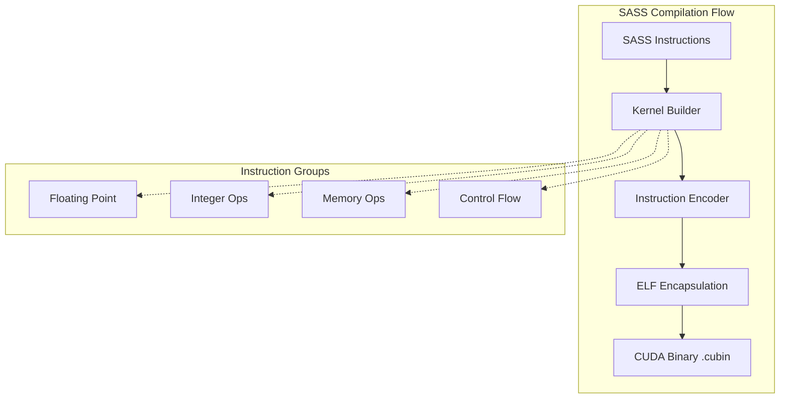

# SASS Assembler

A specialized assembler for NVIDIA's Shader Assembly (SASS) language, targeting native GPU machine code generation.

## 🏛️ Architecture



## 🚀 Features

### Core Capabilities
- **Native GPU Encoding**: Direct encoding of SASS instructions into their binary representation for NVIDIA GPUs.
- **Kernel Management**: Organizes instructions into valid GPU kernels with appropriate ELF section headers (`.text`, `.nv_fatbin`).
- **Instruction Support**: Covers a wide range of SASS instructions including floating-point arithmetic (`FADD`, `FMUL`), integer operations, and global memory access (`LDG`, `STG`).

### Advanced Features
- **ELF/CUBIN Generation**: Automatically wraps generated machine code into standard ELF containers compatible with the CUDA driver API.
- **Disassembly View**: (🚧) Provides tools to disassemble binary kernels back into human-readable SASS text.
- **Control Flow**: Supports basic control flow instructions and termination codes (`EXIT`, `NOP`).

## 💻 Usage

### Generating a Simple CUDA Kernel
The following example shows how to create a basic SASS kernel and write it to a binary file.

```rust
use sass_assembler::{SassWriter, instructions::{SassInstruction, SassReg}, program::{SassProgram, SassKernel}};
use std::fs;

fn main() {
    // 1. Define SASS instructions
    let instructions = vec![
        SassInstruction::FAdd { 
            dst: SassReg::R(0), 
            src0: SassReg::R(1), 
            src1: SassReg::R(2) 
        },
        SassInstruction::Exit,
    ];

    // 2. Build program structure
    let mut program = SassProgram::new("my_kernel".into());
    program.kernels.push(SassKernel {
        name: "my_kernel".into(),
        instructions,
    });

    // 3. Write to binary (simulated ELF)
    let writer = SassWriter::new();
    let binary = writer.write(&program).expect("Failed to generate SASS binary");
    
    fs::write("kernel.cubin", binary).unwrap();
}
```

## 🛠️ Support Status

| Feature | Support Level | Architectures |
| :--- | :---: | :--- |
| Float Ops (FADD/FMUL) | ✅ Full | Volta, Turing, Ampere |
| Integer Ops | ✅ Full | Volta, Turing, Ampere |
| Global Memory (LDG/STG) | ✅ Full | Volta, Turing, Ampere |
| Shared Memory (LDS/STS) | 🚧 Partial | - |
| Predicates | 🚧 Partial | - |

*Legend: ✅ Supported, 🚧 In Progress, ❌ Not Supported*

## 🔗 Relations

- **[gaia-types](../../projects/gaia-types/readme.md)**: Utilizes basic error handling and binary types for instruction encoding.
- **[gaia-assembler](../../projects/gaia-assembler/readme.md)**: Serves as the native NVIDIA GPU backend for the Gaia project, allowing high-performance offloading of compute tasks.
