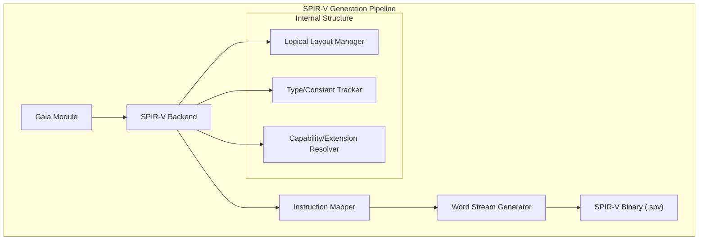

# SPIR-V Assembler

A specialized code generator for SPIR-V (Standard Portable Intermediate Representation), enabling the compilation of Gaia IR into cross-platform GPU shaders for Vulkan, OpenCL, and OpenGL.

## 🏛️ Architecture



## 🚀 Features

### Core Capabilities
- **Direct Binary Emission**: Generates standard-compliant SPIR-V binary streams (32-bit word aligned).
- **Logical Layout Management**: Automatically handles the strict SPIR-V logical layout, including Capability, Extension, MemoryModel, and EntryPoint sections.
- **Type and Constant Deduplication**: Efficiently manages the global type and constant declaration sections to minimize binary size.

### Advanced Features
- **Cross-API Compatibility**: Generates shaders compatible with Vulkan, OpenCL, and OpenGL through appropriate ExecutionModel configurations.
- **Automatic Decoration**: Handles instruction decorations (e.g., `Location`, `Binding`, `DescriptorSet`) required for shader resource linking.
- **Backend Trait Implementation**: Seamlessly integrates into the `gaia-assembler` toolchain as a first-class GPU target.

## 💻 Usage

### Compiling to SPIR-V via Gaia Assembler
The following example shows how to use the SPIR-V generator as a backend for the main assembler.

```rust
use gaia_assembler::assembler::GaiaAssembler;
use spirv_assembler::SpirvGenerator;
use gaia_types::helpers::{Architecture, AbiCompatible, ApiCompatible, CompilationTarget};

fn main() {
    let assembler = GaiaAssembler::new();

    let target = CompilationTarget {
        build: Architecture::X86_64,
        host: AbiCompatible::SPIRV,
        target: ApiCompatible::Vulkan,
    };

    // program: GaiaModule
    let generated = assembler.compile(&program, &target).expect("SPIR-V generation failed");
    
    if let Some(binary) = generated.files.get("module.spv") {
        println!("Generated {} bytes of SPIR-V binary", binary.len());
    }
}
```

## 🛠️ Support Status

| Feature | Support Level | SPIR-V Version |
| :--- | :---: | :--- |
| Core Instructions | ✅ Full | 1.0 - 1.6 |
| Control Flow | ✅ Full | 1.0 - 1.6 |
| Vulkan Memory Model | ✅ Full | 1.3+ |
| Atomic Ops | 🚧 In Progress | 1.0+ |
| Ray Tracing Ops | ❌ Not Supported | - |

*Legend: ✅ Supported, 🚧 In Progress, ❌ Not Supported*

## 🔗 Relations

- **[gaia-assembler](../../projects/gaia-assembler/readme.md)**: Acts as the primary backend for mapping Gaia IR to GPU-agnostic SPIR-V bytecode.
- **[gaia-types](../../projects/gaia-types/readme.md)**: Uses the `CompilationTarget` and `BinaryWriter` for precise 32-bit word-aligned binary construction.
