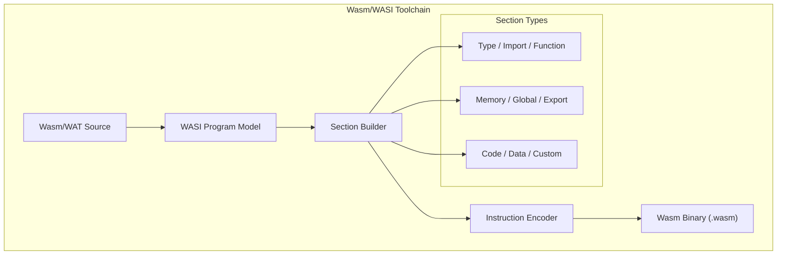

# WASI Assembler

A comprehensive toolchain for WebAssembly (Wasm) and the WebAssembly System Interface (WASI), supporting both binary `.wasm` and text `.wat` formats.

## 🏛️ Architecture



## 🚀 Features

### Core Capabilities
- **Dual Format Support**: Full support for reading and writing both binary `.wasm` files and text-based `.wat` representations.
- **Component Model**: (🚧) Experimental support for the Wasm Component Model, including `component`, `core module`, and `alias` definitions.
- **Instruction Set**: Comprehensive coverage of standard WebAssembly instructions, including numeric, control flow, and memory operations.

### Advanced Features
- **WASI Integration**: Built-in support for defining WASI-specific imports and exports (e.g., `wasi_snapshot_preview1`).
- **Section Management**: Automatic layout and encoding of all standard Wasm sections, plus support for custom sections (e.g., for debugging).
- **Validation**: Includes a basic validator to ensure generated modules adhere to the WebAssembly specification.

## 💻 Usage

### Assembling WAT to WASM
The following example demonstrates how to parse a WAT string and compile it into a WASM binary.

```rust
use wasi_assembler::WasiAssembler;
use std::fs;

fn main() {
    let wat_source = r#"
        (module
            (func $add (param $lhs i32) (param $rhs i32) (result i32)
                local.get $lhs
                local.get $rhs
                i32.add)
            (export "add" (func $add))
        )
    "#;

    let assembler = WasiAssembler::new();
    let binary = assembler.assemble_from_str(wat_source).expect("Failed to assemble WAT");

    fs::write("add.wasm", binary).unwrap();
    println!("Generated add.wasm");
}
```

## 🛠️ Support Status

| Feature | Support Level | Specification |
| :--- | :---: | :--- |
| Core Wasm (MVP) | ✅ Full | Wasm 1.0 |
| WAT Text Format | ✅ Full | Wasm 1.0 |
| WASI Preview 1 | ✅ Full | Snapshot Preview 1 |
| Component Model | 🚧 Partial | Phase 4 (Draft) |
| SIMD / Atomics | 🚧 Partial | Post-MVP |

*Legend: ✅ Supported, 🚧 In Progress, ❌ Not Supported*

## 🔗 Relations

- **[gaia-types](../../projects/gaia-types/readme.md)**: Uses `BinaryWriter` and LEB128 encoding utilities for compact Wasm binary generation.
- **[gaia-assembler](../../projects/gaia-assembler/readme.md)**: Acts as the primary WebAssembly backend for the Gaia project, enabling execution in browsers and WASI runtimes.
