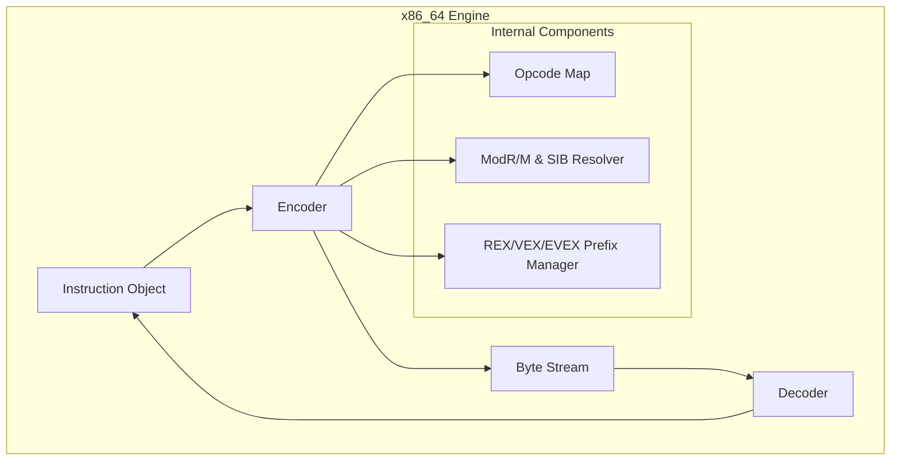

# x86_64 Assembler

A high-performance instruction encoder and decoder for the x86 and x86_64 architectures, providing a robust foundation for native code generation and binary analysis.

## 🏛️ Architecture



## 🚀 Features

### Core Capabilities
- **Full Architecture Support**: Supports both legacy 32-bit x86 and modern 64-bit x86_64 (AMD64) modes.
- **Bi-directional Processing**: Includes a powerful encoder for code generation and a matching decoder for reverse engineering and instrumentation.
- **Instruction Coverage**: Implements a wide range of instructions from basic arithmetic and logic to complex control flow and system calls.

### Advanced Features
- **Prefix Management**: Automatically handles mandatory and optional prefixes, including REX (for x86_64) and SIMD-related prefixes.
- **Fluent Builder API**: Provides a high-level `InstructionBuilder` (🚧) for programmatic instruction construction without manual bit manipulation.
- **Strict Validation**: Ensures that operands, addressing modes, and registers are valid for the target architecture mode.

## 💻 Usage

### Encoding an Instruction
The following example shows how to encode a simple `MOV` instruction into its binary representation.

```rust
use x86_64_assembler::X86_64Assembler;
use x86_64_assembler::instruction::{Instruction, Operand, Register};
use gaia_types::helpers::Architecture;

fn main() {
    // 1. Initialize assembler for 64-bit mode
    let assembler = X86_64Assembler::new(Architecture::X86_64).unwrap();

    // 2. Define an instruction: MOV RAX, 0x42
    let inst = Instruction::new_mov(
        Operand::Register(Register::RAX),
        Operand::Immediate(0x42)
    );

    // 3. Encode to bytes
    let bytes = assembler.encode(&inst).expect("Encoding failed");
    
    println!("Encoded bytes: {:02X?}", bytes);
}
```

## 🛠️ Support Status

| Instruction Group | Support Level | Architecture |
| :--- | :---: | :--- |
| General Purpose | ✅ Full | x86 / x86_64 |
| Control Flow | ✅ Full | x86 / x86_64 |
| Floating Point (x87) | ✅ Full | x86 / x86_64 |
| SSE / SSE2 | ✅ Full | x86 / x86_64 |
| AVX / AVX2 / AVX-512 | 🚧 In Progress | x86_64 |

*Legend: ✅ Supported, 🚧 In Progress, ❌ Not Supported*

## 🔗 Relations

- **[gaia-types](../../projects/gaia-types/readme.md)**: Integrates with the core architecture and error models used across the Gaia project.
- **[gaia-jit](../../projects/gaia-jit/readme.md)**: Provides the underlying encoding engine for the Just-In-Time compiler's native code emission.
- **[gaia-assembler](../../projects/gaia-assembler/readme.md)**: Serves as the primary native target backend for high-performance desktop and server applications.
