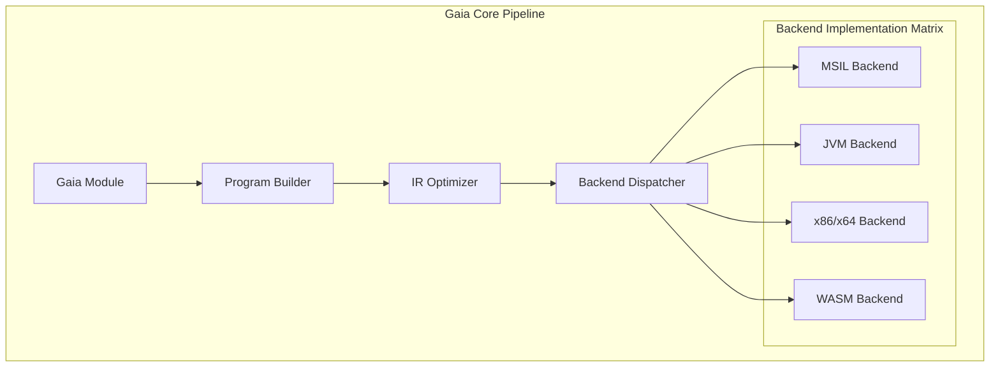

# Gaia Assembler

Gaia Assembler is the core scheduler and instruction translation engine of the Gaia project. It defines a Universal Intermediate Representation (Gaia IR) and maps high-level abstractions to specific virtual machines or hardware backends.

## 🏛️ Architecture



## 🚀 Features

### Core Architecture
- **Unified Intermediate Representation (Gaia IR)**: Uses an opcode-based IR with strongly-typed operands, shielding differences between physical registers and virtual stacks.
- **Modular Backend Interface (Backend Trait)**: Provides a standard API protocol, allowing developers to quickly extend new target platforms by implementing instruction mapping logic.
- **Fluent Builder API**: Offers high-level APIs with chainable calls to construct complex functions, control flow branches, and exception handling blocks.

### Advanced Capabilities
- **Platform-Aware Optimization**: Performs initial instruction preprocessing based on target platform characteristics (e.g., WASM local variables vs. x86 general-purpose registers).
- **Metadata Reflection System**: Automatically collects and associates cross-module type references, method signatures, and field layouts.
- **Diagnostics & Validation**: Conducts static type checking and data flow validation during the assembly phase to ensure generated instruction sequences are valid for the target platform.

## 💻 Usage

### Building a Simple Gaia Module
The following example demonstrates how to build a simple Gaia module with basic arithmetic operations and compile it to a PE binary.

```rust
use gaia_assembler::{
    assembler::GaiaAssembler,
    instruction::{CoreInstruction, GaiaInstruction},
    program::{GaiaBlock, GaiaFunction, GaiaModule, GaiaTerminator},
    types::{GaiaSignature, GaiaType},
};
use gaia_types::helpers::{AbiCompatible, ApiCompatible, Architecture, CompilationTarget};

fn main() {
    // 1. Define a Gaia Module
    let program = GaiaModule {
        name: "example_module".to_string(),
        functions: vec![GaiaFunction {
            name: "main".to_string(),
            signature: GaiaSignature { params: vec![], return_type: GaiaType::I32 },
            blocks: vec![GaiaBlock {
                label: "entry".to_string(),
                instructions: vec![
                    GaiaInstruction::Core(CoreInstruction::PushConstant(10.into())),
                    GaiaInstruction::Core(CoreInstruction::PushConstant(20.into())),
                    GaiaInstruction::Core(CoreInstruction::Add(GaiaType::I32)),
                ],
                terminator: GaiaTerminator::Return,
            }],
            is_external: false,
        }],
        ..Default::default()
    };

    // 2. Compile to Target (e.g., x86_64 Windows PE)
    let assembler = GaiaAssembler::new();
    let target = CompilationTarget {
        build: Architecture::X86_64,
        host: AbiCompatible::PE,
        target: ApiCompatible::MicrosoftVisualC,
    };

    let generated = assembler.compile(&program, &target).expect("Compilation failed");
    
    if let Some(binary) = generated.files.get("main.exe") {
        println!("Generated {} bytes of PE binary", binary.len());
    }
}
```

## 🛠️ Support Status

| Feature / Backend | x86_64 | JVM | MSIL | WASM |
| :--- | :---: | :---: | :---: | :---: |
| Core Instructions | ✅ | ✅ | ✅ | ✅ |
| Control Flow | ✅ | ✅ | ✅ | ✅ |
| Exception Handling | 🚧 | ✅ | ✅ | 🚧 |
| SIMD / Neural Ops | ✅ | 🚧 | 🚧 | 🚧 |
| Dynamic Linking | ✅ | ✅ | ✅ | ✅ |

*Legend: ✅ Supported, 🚧 In Progress, ❌ Not Supported*

## 🔗 Relations

- **[gaia-types](../gaia-types/readme.md)**: Provides the foundational IR definitions, type system, and diagnostic infrastructure used by the assembler.
- **[gaia-jit](../gaia-jit/readme.md)**: Can be used in conjunction with the assembler's x86_64 backend to execute generated machine code immediately in memory.
- **Example Assemblers**: Serves as the high-level orchestration layer for specific format implementations like `clr-assembler`, `jvm-assembler`, and `wasi-assembler`.
