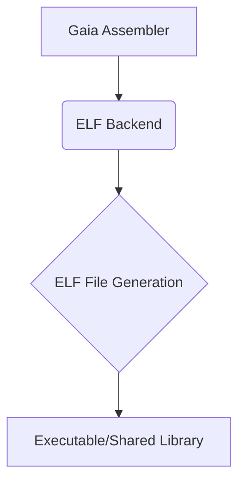

# ELF (Linux/Unix) 后端

ELF (Executable and Linkable Format) 后端通过 Gaia 统一接口为 Linux 和其他 Unix 系统提供编译支持，生成原生可执行文件，支持静态和动态链接。

## 概述



ELF 后端通过 Gaia 统一编译接口为 Linux 和 Unix 平台提供编译支持，生成标准的 ELF 格式二进制文件。通过 Gaia 的 ELF 后端，您可以：

- 生成高性能的原生 Linux/Unix 应用程序
- 创建共享库 (.so) 供其他程序使用
- 与 Linux 内核和系统服务深度集成
- 享受零运行时开销的原生执行性能
- 支持多种处理器架构 (x86-64, ARM64, RISC-V 等)

## 快速示例

```rust
use gaia_assembler::elf::{ElfAssembler, WriterConfig};

// 创建简单的 Hello World 程序
let mut assembler = ElfAssembler::new_executable();
assembler.set_machine(elf::EM_X86_64);
assembler.set_entry_point(0x401000);

// 添加代码段
let text_section = assembler.add_section(".text");
text_section.add_hello_world_syscall();

// 添加数据段
let data_section = assembler.add_section(".data");
data_section.add_string("Hello, World!\n");

// 生成 ELF 文件
let elf_data = assembler.build(WriterConfig::default ()) ?;
std::fs::write("hello", elf_data) ?;
```

## 文档导航

### 🚀 快速开始

- **[入门指南](./getting-started.md)** - 环境配置和第一个 ELF 程序
- **[基础概念](./concepts.md)** - ELF 格式基础知识和核心概念

### 🏗️ 核心功能

- **[ELF 文件结构](./file-structure.md)** - ELF 头、程序头、节区详解
- **[基础概念](./concepts.md)** - ELF 格式核心概念和原理

### 🔗 系统集成

- **[入门指南](./getting-started.md)** - 环境配置和基础使用
- **[用户指南](../../user-guide/index.md)** - Gaia 框架通用功能

### ⚡ 高级特性

- **[用户指南](../../user-guide/index.md)** - 性能优化和调试支持
- **[维护指南](../../maintenance/index.md)** - 安全性和工具集成

### 🛠️ 开发工具

- **[维护指南](../../maintenance/troubleshooting.md)** - 常见问题和解决方案
- **[开发者指南](../../developer-guide/index.md)** - 开发工具和集成

## 核心特性

### ELF 文件生成

- 标准 ELF 格式支持 (32位和64位)
- 可执行文件 (ET_EXEC) 和共享库 (ET_DYN)
- 可重定位文件 (ET_REL) 和核心转储 (ET_CORE)
- 多架构支持 (x86-64, ARM64, RISC-V, MIPS)

### 系统集成

- Linux 系统调用直接接口
- POSIX API 和 GNU C 库集成
- 内核模块和设备驱动支持
- 容器和虚拟化环境兼容

### 链接机制

- 静态链接和动态链接
- 位置无关代码 (PIC) 生成
- 延迟绑定和符号解析
- 链接时优化 (LTO) 支持

## 适用场景

### 系统级编程

- 操作系统内核和模块
- 设备驱动程序
- 系统服务和守护进程
- 底层工具和实用程序

### 高性能计算

- 科学计算和数值分析
- 并行计算和 GPU 加速
- 实时系统和嵌入式应用
- 网络服务器和数据库引擎

### 应用程序开发

- 桌面应用程序 (GTK, Qt)
- 命令行工具和脚本
- 游戏引擎和图形应用
- 容器化应用和微服务

## 架构支持

### x86-64 (AMD64)

- 完整的指令集支持
- SSE/AVX 向量指令
- 系统调用优化
- 性能计数器集成

### ARM64 (AArch64)

- ARMv8 指令集
- NEON 向量处理
- 移动和嵌入式优化
- 低功耗特性

### RISC-V

- 开源指令集架构
- 模块化扩展支持
- 学术和研究应用
- 新兴硬件平台

## 社区支持

- **GitHub 仓库**: [project-gaia](https://github.com/nyar-vm/project-gaia)
- **问题反馈**: [Issues](https://github.com/nyar-vm/project-gaia/issues)
- **讨论社区**: [Discussions](https://github.com/nyar-vm/project-gaia/discussions)
- **文档贡献**: [开发者指南](../../developer-guide/index.md)

## 下一步

1. 从 **[入门指南](./getting-started.md)** 开始学习 ELF 后端的基础使用
2. 了解 **[基础概念](./concepts.md)** 掌握 ELF 格式的核心知识
3. 深入 **[文件结构](./file-structure.md)** 学习 ELF 文件的内部组织
4. 探索 **[用户指南](../../user-guide/index.md)** 了解 Gaia 框架功能

## 性能基准

### 编译速度

- **小型项目** (< 1000 行): < 100ms
- **中型项目** (< 10000 行): < 1s
- **大型项目** (< 100000 行): < 10s

### 运行时性能

- **启动时间**: 与 GCC 生成的二进制文件相当
- **执行速度**: 原生机器码，无解释开销
- **内存占用**: 优化的内存布局和对齐

### 文件大小

- **最小可执行文件**: ~1KB (静态链接)
- **典型应用程序**: 10KB-1MB
- **大型应用程序**: 1MB-100MB

---

*本文档持续更新中，如有问题或建议，欢迎提交 Issue 或 Pull Request。*