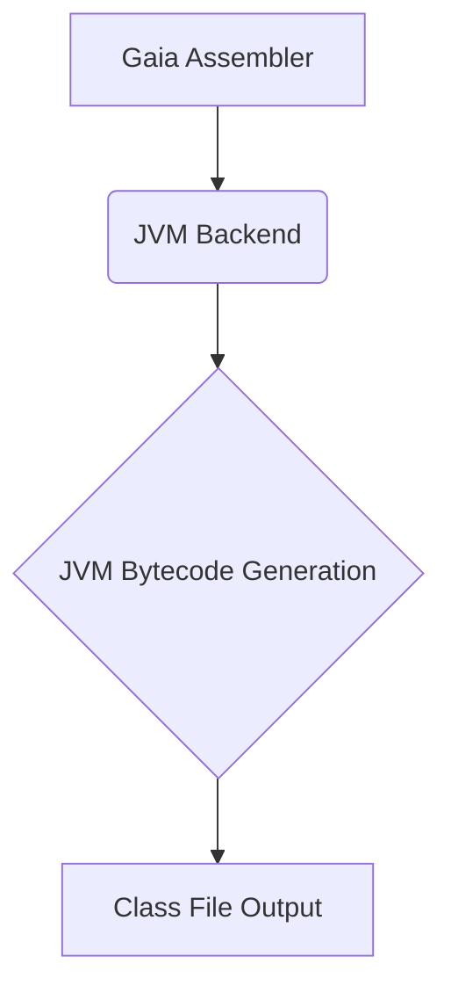

# JVM 后端

Gaia 框架的 JVM 后端支持，通过统一编译接口为 Java 虚拟机平台提供编译支持。

## 概述



JVM 后端通过 Gaia 统一接口为 Java 平台提供编译支持，包括：

- 标准 JVM 字节码生成
- Java 类文件格式
- 与 Java 生态系统的互操作性

## 特性

- **完整的 JVM 支持**：支持所有标准 JVM 指令
- **优化生成**：生成高效的字节码
- **调试信息**：保留源码调试信息
- **兼容性**：与标准 Java 工具链兼容

## 使用方法

```bash
gaia compile --target jvm input.gaia -o output.class
```

## JASM 指令文档

Java Assembly (JASM) 是 Gaia 项目中用于 JVM 字节码的汇编语言。以下是各类指令的详细文档：

### 基础指令

- [基础指令](./basic-instructions.md) - 常量加载、局部变量操作、栈操作
- [算术指令](./arithmetic-instructions.md) - 算术运算、位运算、类型转换

### 控制流指令

- [控制流指令](./control-flow-instructions.md) - 条件跳转、循环、switch 语句
- [方法调用指令](./method-instructions.md) - 方法调用、返回、动态调用

### 对象操作指令

- [对象和类指令](./object-instructions.md) - 对象创建、字段访问、数组操作、类型检查
- [异常处理指令](./exception-instructions.md) - 异常抛出、try-catch-finally、资源管理

## 快速开始

### 基本 JASM 程序结构

```jasm
.class public HelloWorld
.super java/lang/Object

.method public static main([Ljava/lang/String;)V
    .limit stack 2
    .limit locals 1
    
    getstatic Field java/lang/System.out:"Ljava/io/PrintStream;"
    ldc "Hello, World!"
    invokevirtual Method java/io/PrintStream.println:"(Ljava/lang/String;)V"
    return
.end method
```

### 编译和运行

```bash
# 编译 JASM 文件
gaia-jasm compile hello.jasm -o HelloWorld.class

# 运行生成的类文件
java HelloWorld
```

## 核心特性

### 字节码生成

- 标准 JVM 字节码支持
- 类文件格式 (ClassFile)
- 方法区和常量池管理
- 栈帧和局部变量表

### Java 生态集成

- Java 标准库互操作
- Spring Framework 支持
- Maven/Gradle 构建集成
- IDE 调试支持

### 跨平台兼容

- 一次编译，到处运行
- 多种 JVM 实现支持
- Android 运行时兼容
- GraalVM 原生镜像

## 快速开始

### 安装依赖

```toml
[dependencies]
jvm-assembler = { path = "../jvm-assembler" }
gaia-types = { path = "../gaia-types" }
```

### 基本用法

#### 创建简单的 Java 类

```rust
use jvm_assembler::{assembler::JvmAssembler, writer};

// 创建新的 JVM 汇编器
let mut assembler = JvmAssembler::new();

// 创建类
let mut class = assembler.create_class("HelloWorld");
class.set_access_flags(ACC_PUBLIC | ACC_SUPER);
class.set_super_class("java/lang/Object");

// 添加默认构造函数
let mut constructor = class.add_method("<init>", "()V");
constructor.set_access_flags(ACC_PUBLIC);
constructor.add_code( & [
ALOAD_0,                    // load this
INVOKESPECIAL, 0x00, 0x01,  // call super()
RETURN,                     // return
]);

// 添加 main 方法
let mut main_method = class.add_method("main", "([Ljava/lang/String;)V");
main_method.set_access_flags(ACC_PUBLIC | ACC_STATIC);
main_method.add_code( & [
GETSTATIC, 0x00, 0x02,      // System.out
LDC, 0x03,                  // "Hello, World!"
INVOKEVIRTUAL, 0x00, 0x04,  // println
RETURN,                     // return
]);

// 添加常量池条目
class.add_constant_methodref("java/lang/Object", "<init>", "()V");
class.add_constant_fieldref("java/lang/System", "out", "Ljava/io/PrintStream;");
class.add_constant_string("Hello, World!");
class.add_constant_methodref("java/io/PrintStream", "println", "(Ljava/lang/String;)V");

// 生成类文件
let class_data = assembler.build_class(class) ?;

// 保存到文件
std::fs::write("HelloWorld.class", class_data) ?;
```

#### 创建 JAR 包

```rust
use jvm_assembler::jar::JarBuilder;

let mut jar_builder = JarBuilder::new();

// 添加类文件
jar_builder.add_class("HelloWorld.class", & class_data);

// 添加清单文件
jar_builder.set_manifest( & Manifest {
main_class: Some("HelloWorld".to_string()),
version: "1.0".to_string(),
});

// 添加资源文件
jar_builder.add_resource("config.properties", & config_data);

// 生成 JAR 包
let jar_data = jar_builder.build() ?;
std::fs::write("hello.jar", jar_data) ?;
```

## 类文件结构

### ClassFile 格式

```rust
pub struct ClassFile {
    pub magic: u32,                    // 0xCAFEBABE
    pub minor_version: u16,            // 次版本号
    pub major_version: u16,            // 主版本号
    pub constant_pool_count: u16,      // 常量池计数
    pub constant_pool: Vec<CpInfo>,    // 常量池
    pub access_flags: u16,             // 访问标志
    pub this_class: u16,               // 当前类索引
    pub super_class: u16,              // 父类索引
    pub interfaces_count: u16,         // 接口计数
    pub interfaces: Vec<u16>,          // 接口索引
    pub fields_count: u16,             // 字段计数
    pub fields: Vec<FieldInfo>,        // 字段表
    pub methods_count: u16,            // 方法计数
    pub methods: Vec<MethodInfo>,      // 方法表
    pub attributes_count: u16,         // 属性计数
    pub attributes: Vec<AttributeInfo>, // 属性表
}
```

### 常量池 (Constant Pool)

```rust
pub enum CpInfo {
    Utf8 { length: u16, bytes: Vec<u8> },
    Integer { bytes: u32 },
    Float { bytes: u32 },
    Long { high_bytes: u32, low_bytes: u32 },
    Double { high_bytes: u32, low_bytes: u32 },
    Class { name_index: u16 },
    String { string_index: u16 },
    Fieldref { class_index: u16, name_and_type_index: u16 },
    Methodref { class_index: u16, name_and_type_index: u16 },
    InterfaceMethodref { class_index: u16, name_and_type_index: u16 },
    NameAndType { name_index: u16, descriptor_index: u16 },
}

// 添加常量池条目
class.add_constant_utf8("HelloWorld");
class.add_constant_class("HelloWorld");
class.add_constant_methodref("java/lang/Object", "<init>", "()V");
```

### 方法信息 (Method Info)

```rust
pub struct MethodInfo {
    pub access_flags: u16,             // 访问标志
    pub name_index: u16,               // 方法名索引
    pub descriptor_index: u16,         // 描述符索引
    pub attributes_count: u16,         // 属性计数
    pub attributes: Vec<AttributeInfo>, // 属性表
}

// 方法访问标志
const ACC_PUBLIC: u16 = 0x0001;
const ACC_PRIVATE: u16 = 0x0002;
const ACC_PROTECTED: u16 = 0x0004;
const ACC_STATIC: u16 = 0x0008;
const ACC_FINAL: u16 = 0x0010;
const ACC_SYNCHRONIZED: u16 = 0x0020;
const ACC_NATIVE: u16 = 0x0100;
const ACC_ABSTRACT: u16 = 0x0400;
```

## JVM 字节码指令

### 栈操作指令

```rust
// 常量加载
const ACONST_NULL: u8 = 0x01;
const ICONST_M1: u8 = 0x02;
const ICONST_0: u8 = 0x03;
const ICONST_1: u8 = 0x04;
const ICONST_2: u8 = 0x05;
const ICONST_3: u8 = 0x06;
const ICONST_4: u8 = 0x07;
const ICONST_5: u8 = 0x08;

// 局部变量加载
const ILOAD: u8 = 0x15;
const LLOAD: u8 = 0x16;
const FLOAD: u8 = 0x17;
const DLOAD: u8 = 0x18;
const ALOAD: u8 = 0x19;
const ILOAD_0: u8 = 0x1A;
const ILOAD_1: u8 = 0x1B;
const ALOAD_0: u8 = 0x2A;

// 局部变量存储
const ISTORE: u8 = 0x36;
const LSTORE: u8 = 0x37;
const FSTORE: u8 = 0x38;
const DSTORE: u8 = 0x39;
const ASTORE: u8 = 0x3A;
```

### 算术运算指令

```rust
// 整数运算
const IADD: u8 = 0x60;
const ISUB: u8 = 0x64;
const IMUL: u8 = 0x68;
const IDIV: u8 = 0x6C;
const IREM: u8 = 0x70;
const INEG: u8 = 0x74;

// 浮点运算
const FADD: u8 = 0x62;
const FSUB: u8 = 0x66;
const FMUL: u8 = 0x6A;
const FDIV: u8 = 0x6E;
const FREM: u8 = 0x72;
const FNEG: u8 = 0x76;

// 位运算
const ISHL: u8 = 0x78;
const ISHR: u8 = 0x7A;
const IUSHR: u8 = 0x7C;
const IAND: u8 = 0x7E;
const IOR: u8 = 0x80;
const IXOR: u8 = 0x82;
```

### 对象操作指令

```rust
// 对象创建
const NEW: u8 = 0xBB;
const NEWARRAY: u8 = 0xBC;
const ANEWARRAY: u8 = 0xBD;
const MULTIANEWARRAY: u8 = 0xC5;

// 字段访问
const GETFIELD: u8 = 0xB4;
const PUTFIELD: u8 = 0xB5;
const GETSTATIC: u8 = 0xB2;
const PUTSTATIC: u8 = 0xB3;

// 数组访问
const IALOAD: u8 = 0x2E;
const LALOAD: u8 = 0x2F;
const FALOAD: u8 = 0x30;
const DALOAD: u8 = 0x31;
const AALOAD: u8 = 0x32;
const IASTORE: u8 = 0x4F;
const AASTORE: u8 = 0x53;
```

### 方法调用指令

```rust
// 方法调用
const INVOKEVIRTUAL: u8 = 0xB6;
const INVOKESPECIAL: u8 = 0xB7;
const INVOKESTATIC: u8 = 0xB8;
const INVOKEINTERFACE: u8 = 0xB9;
const INVOKEDYNAMIC: u8 = 0xBA;

// 方法返回
const IRETURN: u8 = 0xAC;
const LRETURN: u8 = 0xAD;
const FRETURN: u8 = 0xAE;
const DRETURN: u8 = 0xAF;
const ARETURN: u8 = 0xB0;
const RETURN: u8 = 0xB1;
```

## 类型系统映射

### 基本类型

```rust
// Gaia 类型到 JVM 类型映射
pub fn map_primitive_type(gaia_type: &GaiaType) -> &'static str {
    match gaia_type {
        GaiaType::Bool => "Z",      // boolean
        GaiaType::I8 => "B",        // byte
        GaiaType::I16 => "S",       // short
        GaiaType::I32 => "I",       // int
        GaiaType::I64 => "J",       // long
        GaiaType::F32 => "F",       // float
        GaiaType::F64 => "D",       // double
        GaiaType::Char => "C",      // char
        GaiaType::String => "Ljava/lang/String;",
        _ => "Ljava/lang/Object;",
    }
}
```

### 复合类型

```rust
// 数组类型
pub fn map_array_type(element_type: &str) -> String {
    format!("[{}", element_type)
}

// 泛型类型
pub fn map_generic_type(base_type: &str, type_params: &[String]) -> String {
    format!("L{}<{}>;", base_type, type_params.join(","))
}

// 函数类型
pub fn map_function_type(params: &[String], return_type: &str) -> String {
    format!("({}){}", params.join(""), return_type)
}
```

## 异常处理

### 异常表 (Exception Table)

```rust
pub struct ExceptionHandler {
    pub start_pc: u16,      // 开始 PC
    pub end_pc: u16,        // 结束 PC
    pub handler_pc: u16,    // 处理器 PC
    pub catch_type: u16,    // 异常类型索引
}

// 添加异常处理器
method.add_exception_handler(ExceptionHandler {
start_pc: 0,
end_pc: 10,
handler_pc: 15,
catch_type: class.add_constant_class("java/lang/Exception"),
});
```

### try-catch 代码生成

```rust
// 生成 try-catch 块
fn generate_try_catch(
    try_code: &[u8],
    catch_code: &[u8],
    exception_type: &str
) -> Vec<u8> {
    let mut code = Vec::new();

    // try 块开始
    let try_start = code.len() as u16;
    code.extend_from_slice(try_code);
    let try_end = code.len() as u16;

    // 正常流程跳转
    code.push(GOTO);
    code.extend_from_slice(&[0x00, 0x05]); // 跳过 catch 块

    // catch 块开始
    let catch_start = code.len() as u16;
    code.extend_from_slice(catch_code);

    // 添加异常处理器
    // (在方法属性中添加)

    code
}
```

## 反射和注解

### 注解支持

```rust
// 添加注解
class.add_annotation("@Override");
class.add_annotation("@Deprecated");

// 运行时注解
class.add_runtime_annotation("@Component", & [
("value", AnnotationValue::String("myService")),
]);

// 参数注解
method.add_parameter_annotation(0, "@NotNull");
```

### 反射元数据

```rust
// 添加反射信息
class.add_attribute("Signature", signature_data);
class.add_attribute("SourceFile", source_file_data);
class.add_attribute("LineNumberTable", line_number_data);
class.add_attribute("LocalVariableTable", local_var_data);
```

## 性能优化

### 字节码优化

```rust
// 常量折叠
fn optimize_constants(code: &mut Vec<u8>) {
    // ICONST_1 ICONST_2 IADD -> ICONST_3
    for i in 0..code.len().saturating_sub(2) {
        if code[i] == ICONST_1 && code[i + 1] == ICONST_2 && code[i + 2] == IADD {
            code[i] = ICONST_3;
            code.drain(i + 1..i + 3);
        }
    }
}

// 死代码消除
fn eliminate_dead_code(code: &mut Vec<u8>) {
    // 移除 RETURN 后的代码
    if let Some(pos) = code.iter().position(|&x| x == RETURN) {
        code.truncate(pos + 1);
    }
}
```

### JIT 编译优化

```rust
// 热点方法标记
method.set_hot_spot(true);

// 内联提示
method.add_inline_hint();

// 循环优化标记
method.mark_loop_optimization(start_pc, end_pc);
```

## 调试支持

### 调试信息生成

```rust
// 行号表
let line_number_table = LineNumberTable::new();
line_number_table.add_entry(0, 10);  // PC 0 对应源码第 10 行
line_number_table.add_entry(5, 11);  // PC 5 对应源码第 11 行

// 局部变量表
let local_variable_table = LocalVariableTable::new();
local_variable_table.add_variable(
"args", "[Ljava/lang/String;", 0, 20, 0
);
```

### JDWP 调试协议

```rust
// 启用调试支持
class.enable_debug_info(true);

// 添加断点信息
class.add_breakpoint_info(method_index, pc);
```

## 模块系统 (JPMS)

### 模块描述符

```rust
// 创建 module-info.class
let mut module = assembler.create_module("com.example.myapp");

// 导出包
module.export_package("com.example.api");

// 依赖模块
module.require_module("java.base");
module.require_module("java.logging");

// 提供服务
module.provide_service("com.example.Service", "com.example.ServiceImpl");

// 使用服务
module.use_service("java.util.logging.Logger");
```

## 互操作性

### Java 互操作

```rust
// 调用 Java 方法
let java_method = class.add_java_method_call(
"java/lang/System",
"currentTimeMillis",
"()J"
);

// 实现 Java 接口
class.implement_interface("java/lang/Runnable");
class.add_method("run", "()V");
```

### Kotlin 互操作

```rust
// Kotlin 元数据注解
class.add_kotlin_metadata( & kotlin_metadata);

// 协程支持
class.add_coroutine_support();
```

### Scala 互操作

```rust
// Scala 签名
class.add_scala_signature( & scala_sig);

// 特质实现
class.implement_trait("scala.Function1");
```

## 构建集成

### Maven 集成

```xml

<plugin>
    <groupId>com.example</groupId>
    <artifactId>gaia-maven-plugin</artifactId>
    <version>1.0.0</version>
    <executions>
        <execution>
            <goals>
                <goal>compile</goal>
            </goals>
        </execution>
    </executions>
</plugin>
```

### Gradle 集成

```kotlin
plugins {
    id("com.example.gaia") version "1.0.0"
}

gaia {
    sourceDir = "src/main/gaia"
    targetCompatibility = "11"
    optimizationLevel = "O2"
}
```

## 部署和运行

### 标准 JVM 运行

```bash
# 编译 Gaia 代码
gaia compile --target jvm src/main.gaia

# 运行生成的类文件
java -cp . HelloWorld

# 运行 JAR 包
java -jar hello.jar
```

### GraalVM 原生镜像

```bash
# 生成原生镜像
native-image --class-path hello.jar HelloWorld

# 运行原生可执行文件
./helloworld
```

### Android 运行

```bash
# 转换为 DEX 格式
d8 --output classes.dex HelloWorld.class

# 打包为 APK
aapt package -f -M AndroidManifest.xml -I android.jar -F app.apk classes.dex
```

## 故障排除

### 常见问题

1. **VerifyError**: 检查字节码验证规则
2. **ClassFormatError**: 验证类文件格式
3. **NoSuchMethodError**: 确认方法签名正确
4. **StackOverflowError**: 检查递归调用和栈深度

### 调试技巧

- 使用 `javap -v` 反汇编类文件
- 使用 `jdb` 进行字节码级调试
- 检查常量池索引是否正确
- 验证方法描述符格式

## 示例项目

查看 `examples/` 目录中的示例：

- `hello_world.rs` - 基本 Hello World
- `calculator.rs` - 计算器应用
- `web_service.rs` - Web 服务示例

## 相关资源

- [JVM 规范](https://docs.oracle.com/javase/specs/jvms/se11/html/)
- [Java 字节码指令集](https://docs.oracle.com/javase/specs/jvms/se11/html/jvms-6.html)
- [类文件格式](https://docs.oracle.com/javase/specs/jvms/se11/html/jvms-4.html)
- [JPMS 模块系统](https://openjdk.java.net/projects/jigsaw/)