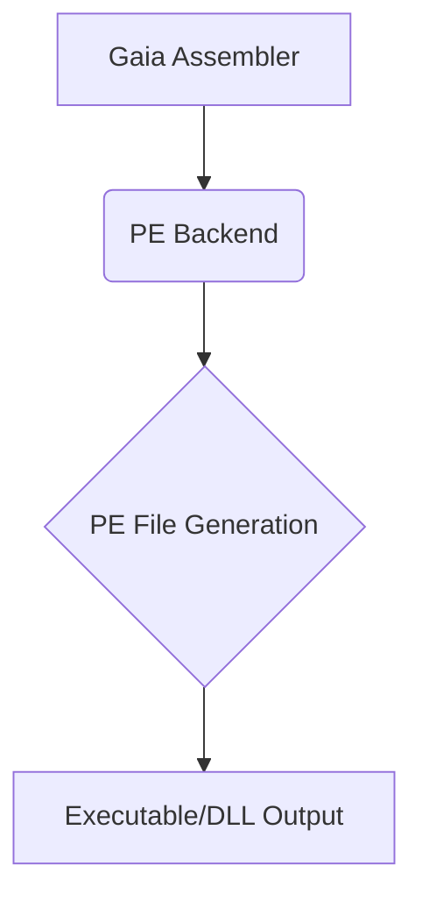

# PE (Windows) 后端

PE (Portable Executable) 后端通过 Gaia 统一接口为 Windows 平台提供编译支持，生成原生可执行文件，支持 EXE 和 DLL 格式。

## 概述



PE 后端通过 Gaia 统一编译接口为 Windows 平台提供编译支持，生成标准的 PE 格式二进制文件。通过 Gaia 的 PE 后端，您可以：

- 生成高性能的原生 Windows 应用程序
- 创建动态链接库 (DLL) 供其他程序使用
- 与 Windows API 和系统服务深度集成
- 享受零运行时开销的原生执行性能

## 快速示例

```rust
use gaia_assembler::pe::{PeAssembler, WriterConfig};

// 创建简单的 Hello World 程序
let mut assembler = PeAssembler::new_console_app();
assembler.set_entry_point(0x1000);

// 添加代码段
let text_section = assembler.add_section(".text");
text_section.add_hello_world_code();

// 添加导入
assembler.add_import("msvcrt.dll", & ["printf"]);

// 生成 PE 文件
let pe_data = assembler.build(WriterConfig::default ()) ?;
std::fs::write("hello.exe", pe_data) ?;
```

## 文档导航

### 🚀 快速开始

- **[入门指南](./getting-started.md)** - 环境配置和第一个 PE 程序
- **[基础概念](./concepts.md)** - PE 格式基础知识和核心概念

### 🏗️ 核心功能

- **[PE 文件结构](./file-structure.md)** - DOS 头、NT 头、节区详解
- **[基础概念](./concepts.md)** - PE 格式核心概念和原理

### 🔗 系统集成

- **[入门指南](./getting-started.md)** - 环境配置和基础使用
- **[用户指南](../../user-guide/index.md)** - Gaia 框架通用功能

### ⚡ 高级特性

- **[用户指南](../../user-guide/index.md)** - 性能优化和调试支持
- **[维护指南](../../maintenance/index.md)** - 安全性和工具集成

### 🛠️ 开发工具

- **[维护指南](../../maintenance/troubleshooting.md)** - 常见问题和解决方案
- **[开发者指南](../../developer-guide/index.md)** - 开发工具和集成

## 核心特性

### PE 文件生成

- 标准 PE/COFF 格式支持
- 可执行文件 (.exe) 和动态链接库 (.dll)
- 控制台和 GUI 应用程序
- 32位和64位架构支持

### Windows 集成

- Kernel32、User32 等系统 DLL 集成
- Windows API 直接调用
- COM 组件支持
- .NET 互操作性

### 性能优势

- 直接机器码执行，无解释开销
- 最小化启动时间
- 优化的内存布局
- 原生系统调用性能

## 适用场景

### 系统级应用

- 设备驱动程序
- 系统服务和守护进程
- 底层工具和实用程序

### 高性能应用

- 游戏引擎和图形应用
- 科学计算和数值分析
- 实时系统和嵌入式应用

### 企业应用

- 桌面应用程序
- 服务器端组件
- 数据库引擎和中间件

## 社区支持

- **GitHub 仓库**: [project-gaia](https://github.com/nyar-vm/project-gaia)
- **问题反馈**: [Issues](https://github.com/nyar-vm/project-gaia/issues)
- **讨论社区**: [Discussions](https://github.com/nyar-vm/project-gaia/discussions)
- **文档贡献**: [开发者指南](../../developer-guide/index.md)

## 下一步

1. 从 **[入门指南](./getting-started.md)** 开始学习 PE 后端的基础使用
2. 了解 **[基础概念](./concepts.md)** 掌握 PE 格式的核心知识
3. 深入 **[文件结构](./file-structure.md)** 学习 PE 文件的内部组织
4. 探索 **[用户指南](../../user-guide/index.md)** 了解 Gaia 框架功能

---

*本文档持续更新中，如有问题或建议，欢迎提交 Issue 或 Pull Request。*