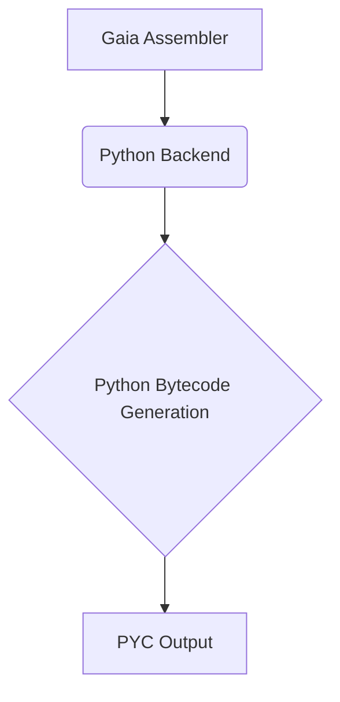

# Python 后端 (PYC)

Gaia 框架的 Python 后端生成标准的 Python 字节码 (.pyc)，兼容 Python 3.x 版本。

## 特性



- **字节码生成**: 生成优化的 Python 字节码 (.pyc)
- **版本兼容**: 支持 Python 3.6+
- **跨平台**: 支持所有 Python 支持的平台
- **丰富生态**: 无缝集成 Python 标准库和第三方库
- **数据科学**: 特别适合数据处理和机器学习应用

## 应用场景

- **数据科学**: 数据分析、机器学习、科学计算
- **Web 开发**: Web 应用和 API 服务
- **自动化**: 脚本编写和自动化任务
- **人工智能**: AI 和机器学习应用
- **快速原型**: 快速开发和测试

## 开始使用

```bash
# 编译到 Python 字节码
gaia compile --backend=pyc input.gaia -o output.pyc

# 运行编译后的字节码
python output.pyc
```

## 优化选项

- **字节码优化**: Python 字节码级别优化
- **调试信息**: 可选的调试符号生成
- **模块打包**: 支持打包为 Python 模块
- **类型注解**: 生成 Python 类型注解

## 集成特性

- **标准库集成**: 自动导入和使用 Python 标准库
- **第三方库**: 支持 numpy、pandas、tensorflow 等库
- **C 扩展**: 支持 Python C 扩展模块
- **虚拟环境**: 兼容 Python 虚拟环境

## 相关文档

- [基本指令](basic-instructions.md)
- [算术指令](arithmetic-instructions.md)
- [控制流指令](control-flow-instructions.md)
- [函数和方法](method-instructions.md)
- [异常处理](exception-instructions.md)
- [对象操作](object-instructions.md)