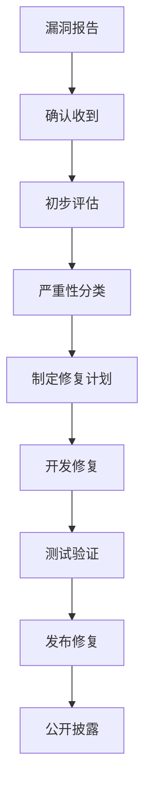

# 安全指南

本文档描述 Gaia Assembler 项目的安全策略、最佳实践和漏洞处理流程。

## 安全策略

### 支持的版本

我们为以下版本提供安全更新：

| 版本    | 支持状态   |
|-------|--------|
| 0.3.x | ✅ 完全支持 |
| 0.2.x | ✅ 安全修复 |
| 0.1.x | ❌ 不再支持 |

### 安全目标

1. **代码安全**: 防止恶意代码注入和执行
2. **内存安全**: 避免缓冲区溢出和内存泄漏
3. **输入验证**: 严格验证所有外部输入
4. **权限控制**: 最小权限原则
5. **数据保护**: 保护敏感信息

## 安全最佳实践

### 1. 代码审查

所有代码变更必须经过安全审查：

```rust
// 好的做法：使用安全的字符串操作
fn safe_string_operation(input: &str) -> Result<String, Error> {
    if input.len() > MAX_INPUT_SIZE {
        return Err(Error::InputTooLarge);
    }
    
    // 使用安全的字符串处理
    Ok(input.chars()
        .filter(|c| c.is_alphanumeric())
        .collect())
}

// 避免：不安全的内存操作
// unsafe {
//     std::ptr::copy_nonoverlapping(src, dst, len);
// }
```

### 2. 输入验证

严格验证所有外部输入：

```rust
use validator::{Validate, ValidationError};

#[derive(Validate)]
struct AssemblyInput {
    #[validate(length(min = 1, max = 1000000))]
    source_code: String,
    
    #[validate(custom = "validate_filename")]
    filename: String,
}

fn validate_filename(filename: &str) -> Result<(), ValidationError> {
    if filename.contains("..") || filename.contains("/") {
        return Err(ValidationError::new("invalid_filename"));
    }
    Ok(())
}
```

### 3. 错误处理

安全的错误处理，避免信息泄露：

```rust
#[derive(Debug)]
pub enum SecureError {
    InvalidInput,
    CompilationFailed,
    InternalError,
}

impl fmt::Display for SecureError {
    fn fmt(&self, f: &mut fmt::Formatter) -> fmt::Result {
        match self {
            SecureError::InvalidInput => write!(f, "Invalid input provided"),
            SecureError::CompilationFailed => write!(f, "Compilation failed"),
            SecureError::InternalError => write!(f, "Internal error occurred"),
        }
    }
}
```

### 4. 依赖管理

定期审查和更新依赖：

```bash
# 检查已知漏洞
cargo audit

# 更新依赖
cargo update

# 检查过时依赖
cargo outdated
```

### 5. 内存安全

利用 Rust 的内存安全特性：

```rust
// 使用智能指针避免内存泄漏
use std::rc::Rc;
use std::cell::RefCell;

struct SafeCompiler {
    modules: Rc<RefCell<Vec<Module>>>,
}

impl SafeCompiler {
    fn add_module(&self, module: Module) {
        self.modules.borrow_mut().push(module);
    }
}
```

## 安全测试

### 1. 静态分析

```bash
# Clippy 安全检查
cargo clippy -- -W clippy::all -W clippy::pedantic

# 格式检查
cargo fmt --check

# 依赖漏洞扫描
cargo audit
```

### 2. 模糊测试

```rust
use libfuzzer_sys::fuzz_target;

fuzz_target!(|data: &[u8]| {
    if let Ok(s) = std::str::from_utf8(data) {
        let _ = gaia_assembler::compile(s);
    }
});
```

### 3. 集成测试

```rust
#[test]
fn test_malicious_input() {
    let malicious_inputs = vec![
        "../../../etc/passwd",
        "'; DROP TABLE users; --",
        "\x00\x01\x02\x03",
        "A".repeat(1000000),
    ];
    
    for input in malicious_inputs {
        let result = gaia_assembler::compile(&input);
        assert!(result.is_err());
    }
}
```

## 漏洞报告

### 报告流程

1. **私密报告**: 发送邮件至 security@gaia-assembler.org
2. **不要公开**: 在修复前不要公开披露
3. **提供详情**: 包含复现步骤和影响评估
4. **等待响应**: 我们会在 48 小时内响应

### 报告模板

```
标题: [SECURITY] 简短描述

描述:
详细描述安全漏洞

影响:
- 受影响的版本
- 潜在的安全风险
- 攻击场景

复现步骤:
1. 步骤一
2. 步骤二
3. ...

环境信息:
- 操作系统
- Rust 版本
- Gaia Assembler 版本

建议修复:
如果有修复建议，请提供
```

### 响应时间

- **确认**: 48 小时内
- **初步评估**: 7 天内
- **修复计划**: 14 天内
- **修复发布**: 30 天内（严重漏洞 7 天内）

## 安全配置

### 1. 编译器配置

```toml
[profile.release]
# 启用所有安全检查
overflow-checks = true
debug-assertions = true

# 优化设置
opt-level = 3
lto = true
codegen-units = 1
```

### 2. 运行时配置

```rust
// 设置资源限制
fn configure_limits() {
    // 限制内存使用
    const MAX_MEMORY: usize = 1024 * 1024 * 1024; // 1GB
    
    // 限制编译时间
    const MAX_COMPILE_TIME: Duration = Duration::from_secs(300); // 5分钟
    
    // 限制输出大小
    const MAX_OUTPUT_SIZE: usize = 100 * 1024 * 1024; // 100MB
}
```

### 3. 沙箱环境

```rust
// 在受限环境中执行编译
fn compile_in_sandbox(source: &str) -> Result<Vec<u8>, Error> {
    // 创建临时目录
    let temp_dir = tempfile::tempdir()?;
    
    // 设置权限限制
    #[cfg(unix)]
    {
        use std::os::unix::fs::PermissionsExt;
        let mut perms = temp_dir.path().metadata()?.permissions();
        perms.set_mode(0o700);
        std::fs::set_permissions(temp_dir.path(), perms)?;
    }
    
    // 在沙箱中编译
    let result = compile_with_limits(source, &temp_dir)?;
    
    Ok(result)
}
```

## 安全工具

### 1. 自动化扫描

```yaml
# .github/workflows/security.yml
name: Security Scan

on: [push, pull_request]

jobs:
  security:
    runs-on: ubuntu-latest
    steps:
      - uses: actions/checkout@v2
      
      - name: Install Rust
        uses: actions-rs/toolchain@v1
        with:
          toolchain: stable
          
      - name: Security Audit
        run: |
          cargo install cargo-audit
          cargo audit
          
      - name: Clippy Security
        run: cargo clippy -- -W clippy::all
```

### 2. 依赖检查

```bash
#!/bin/bash
# scripts/security-check.sh

echo "Running security checks..."

# 检查依赖漏洞
cargo audit

# 检查过时依赖
cargo outdated

# 运行安全相关的 Clippy 检查
cargo clippy -- \
  -W clippy::all \
  -W clippy::pedantic \
  -W clippy::nursery \
  -W clippy::cargo

echo "Security checks completed."
```

## 事件响应

### 1. 漏洞分类

- **严重 (Critical)**: 远程代码执行、权限提升
- **高危 (High)**: 信息泄露、拒绝服务
- **中危 (Medium)**: 本地权限提升、输入验证绕过
- **低危 (Low)**: 信息泄露（有限）

### 2. 响应流程



### 3. 通知机制

- **内部通知**: Slack/Teams 通知开发团队
- **用户通知**: GitHub Security Advisory
- **社区通知**: 官方博客和邮件列表

## 合规性

### 1. 数据保护

- 不收集用户个人信息
- 不存储编译的源代码
- 遵循 GDPR 和其他隐私法规

### 2. 开源许可

- 确保所有依赖的许可证兼容
- 定期审查许可证变更
- 维护许可证清单

### 3. 出口管制

- 遵循相关出口管制法规
- 不包含受限制的加密算法
- 提供合规性声明

## 相关资源

- [Rust 安全指南](https://doc.rust-lang.org/nomicon/)
- [OWASP 安全指南](https://owasp.org/)
- [CVE 数据库](https://cve.mitre.org/)
- [RustSec 咨询数据库](https://rustsec.org/)