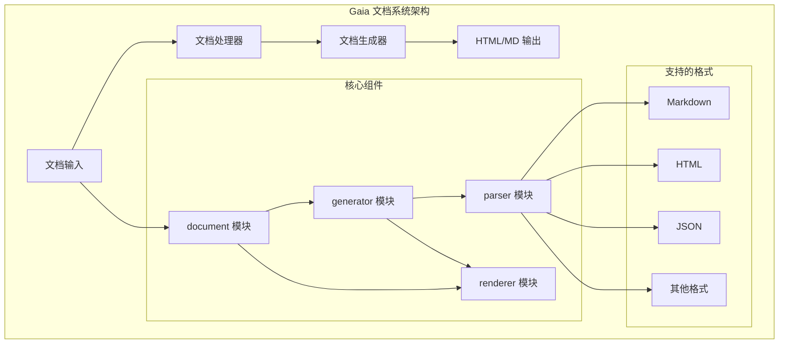
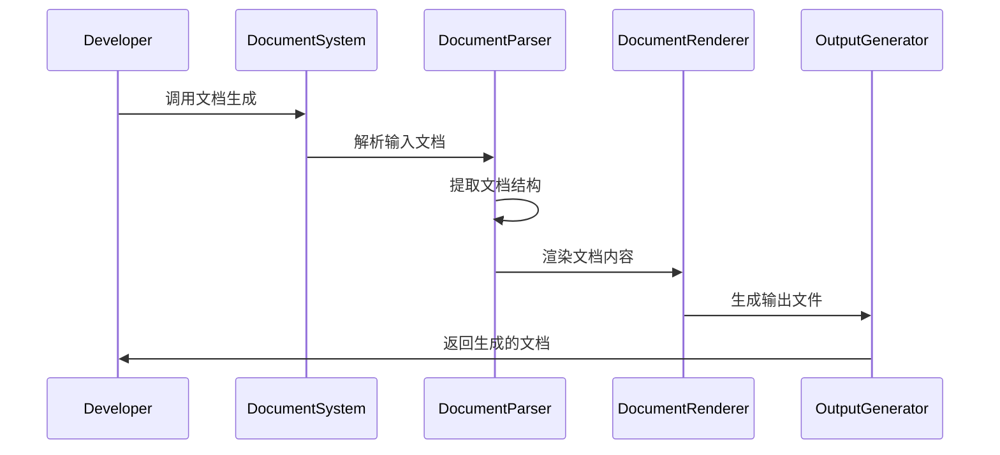

# Gaia 文档系统

[](https://opensource.org/licenses/MIT)
[](https://github.com/gaia-lang/gaia/tree/main/projects/gaia-document)

## 项目概述

Gaia Document 是Gaia项目的完整文档系统，为多语言统一接口框架提供全面的文档支持，包括用户指南、开发文档和维护手册。

## 架构概览



### 文档生成流程



## 项目状态

- **开发阶段**: 📚 完善可用
- **版本**: 0.1.0
- **稳定性**: 生产就绪
- **文档完整性**: 高

## 核心特性

### 多层级文档

- 用户指南和教程
- 开发者文档
- 维护手册
- API参考文档

### 现代化文档工具

- 基于VitePress构建
- 响应式设计
- 搜索功能支持
- 多语言支持

### 内容管理系统

- 结构化文档组织
- 版本控制集成
- 自动构建部署
- 社区贡献支持

## 技术栈

- **文档引擎**: VitePress
- **构建工具**: Vite
- **部署平台**: GitHub Pages / Netlify
- **代码质量**: ESLint + Prettier

## 使用方法

### 开发环境设置

```bash
# 克隆仓库
git clone https://github.com/gaia-lang/gaia.git
cd gaia/projects/gaia-document

# 安装依赖
npm install

# 启动开发服务器
npm run dev
```

### 构建文档

```bash
# 构建生产版本
npm run build

# 预览生产版本
npm run preview
```

### 内容贡献

```bash
# 创建新的文档页面
npm run new:page -- "新页面标题"

# 检查文档链接
npm run check:links

# 格式化文档
npm run format
```

## 开发

### 前置要求

- Node.js 18+
- npm 或 yarn
- Git

### 设置

```bash
# 安装依赖
npm install

# 启动开发服务器
npm run dev

# 构建生产版本
npm run build
```

### 贡献

1. Fork 仓库
2. 创建功能分支
3. 进行更改
4. 如适用，添加测试
5. 提交拉取请求

### 测试

```bash
# 运行测试
npm test

# 运行测试并生成覆盖率报告
npm run test:coverage
```

### 部署

```bash
# 构建生产版本
npm run build

# 部署到 GitHub Pages
npm run deploy
```

## 文档结构

### 用户文档

- 📚 [快速开始](getting-started/) - 安装和基本使用
- 📖 [用户指南](user-guide/) - 详细的使用说明
- 🔧 [后端文档](backends/) - 各平台后端支持

### 开发者文档

- 🔧 [开发者指南](developer-guide/) - 扩展和定制指南
- 📦 [API 参考](api-reference/) - 详细的 API 文档
- 🔬 [内部实现](api-reference/) - 深入的实现细节

### 维护文档

- ⚙️ [维护指南](maintenance/) - 项目维护信息

## API 参考

### 配置 API

文档系统提供多种配置选项：

- **主题配置**: 可自定义的主题和样式
- **导航结构**: 灵活的导航和侧边栏配置
- **搜索配置**: 可配置的搜索功能
- **多语言支持**: 语言特定的文档路径

### 插件系统

系统支持各种插件以扩展功能：

- **代码高亮**: 多语言的语法高亮
- **交互式示例**: 实时代码执行和演示
- **API 文档**: 从源代码自动生成 API 文档
- **版本管理**: 多版本文档支持

### 部署选项

- **静态托管**: 部署到任何静态托管服务
- **GitHub Pages**: 直接部署到 GitHub Pages
- **自定义域名**: 支持自定义域名配置
- **CDN 集成**: 内容分发网络优化

## 架构概述

```
源代码 → 前端解析 → HIR → MIR → LIR → 字节码 → 虚拟机执行
```

### 文档层次结构

```
nyar-document/
├── guide/           # 用户指南
├── development/     # 开发文档
├── maintenance/     # 维护手册
├── language/        # 语言规范
├── api/            # API参考
└── examples/       # 示例代码
```

## 平台优势

### 对于应用开发者

- 🎯 **表达性语言**: 使用Valkyrie的现代特性如代数效应
- 🚀 **高性能**: 受益于Nyar的高级优化
- 🌐 **随处部署**: 单一代码库可在Web、服务器和桌面运行
- 🛠️ **强大工具**: 丰富的IDE支持和调试工具

### 对于语言设计者

- 🏗️ **坚实基础**: 基于成熟的虚拟机技术构建
- ⚡ **性能优势**: 免费获得JIT编译和优化
- 🔧 **多目标支持**: 自动支持多种部署目标
- 📊 **分析工具**: 内置的性能分析和剖析支持

### 对于平台工程师

- 🔬 **研究平台**: 实验新的语言特性
- 📈 **优化能力**: 基于IR的高级优化管道
- 🧪 **可扩展性**: 自定义后端的插件架构
- 📚 **完善文档**: 全面的文档和示例

## 社区

- 💬 [Discord社区](https://discord.gg/nyar-vm)
- 🐛 [问题追踪](https://github.com/nyar-lang/nyar-vm/issues)
- 💡 [讨论区](https://github.com/nyar-lang/nyar-vm/discussions)
- 📧 [邮件列表](https://groups.google.com/g/nyar-vm)

## 贡献

我们欢迎对 Gaia Assembler 项目的贡献！详情请参考：

- [开发者指南](developer-guide/) - 开发和贡献指南
- [维护指南](maintenance/) - 项目维护信息

### 开发领域

- 🔧 汇编器优化和性能改进
- 🌐 新的编译目标和后端
- 📚 文档和教育内容
- 🛠️ 开发者工具和IDE集成
- 🧪 测试、基准测试和质量保证

## 许可证

本项目采用MIT许可证。

## 致谢

- 灵感来源于LLVM、JVM和其他成功的编译器平台
- 使用Rust构建以确保内存安全和性能
- 为现代化汇编器工具链设计

---

**准备好开始使用 Gaia Assembler 了吗？** [快速开始](getting-started/)