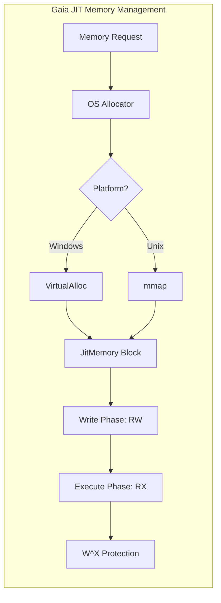

# Gaia JIT

Gaia JIT provides industrial-grade cross-platform dynamic memory management, specialized for executable memory allocation and permission control in Just-In-Time (JIT) compilation scenarios.

## 🏛️ Architecture



## 🚀 Features

### Core Security Strategy
- **W^X (Write XOR Execute)**: Enforces a strict security policy ensuring that a physical memory page is either writable or executable at any given moment, but never both, defending against buffer overflow exploits.
- **Automatic Transition Mechanism**: `JitMemory` abstracts complex low-level system calls (e.g., `VirtualProtect` on Windows, `mprotect` on Unix) to automatically switch to write permissions during instruction encoding and to execute permissions before invocation.

### Platform Adaptation Layer
- **Windows Support**: Deeply integrates with Win32 Memory APIs and automatically invokes `FlushInstructionCache` to ensure CPU instruction cache synchronization in multi-core environments.
- **Unix/POSIX Support**: Implemented via `mmap` and `mprotect`, compatible with Linux, macOS, and various BSD systems.
- **Alignment & Paging**: Automatically detects system Page Size to ensure memory blocks are perfectly aligned on page boundaries, optimizing cache line utilization.

### Advanced Memory Operations
- **Zero-Copy Execution**: Supports direct mapping of generated machine code streams to function pointers.
- **Lifecycle Management**: Leverages Rust's RAII mechanism to ensure JIT memory blocks are safely and promptly released when they go out of scope, preventing memory leaks.

## 💻 Usage

### Basic JIT Execution
The following example shows how to allocate JIT memory, write machine code, and execute it safely.

```rust
use gaia_jit::JitMemory;

fn main() -> std::io::Result<()> {
    // 1. Allocate a new JIT memory block (e.g., 4KB)
    let mut jit = JitMemory::new(4096)?;
    
    // 2. Write machine code (Example: x86_64 nop; ret)
    // 0x90 = nop, 0xC3 = ret
    jit.write(&[0x90, 0xc3])?;
    
    // 3. Transition memory to executable state
    jit.make_executable()?;
    
    // 4. Cast to function pointer and execute
    unsafe {
        let f: unsafe extern "C" fn() = jit.as_fn();
        f();
    }
    
    Ok(())
}
```

## 🛠️ Support Status

| Platform | Memory Allocation | W^X Protection | Cache Flushing |
| :--- | :---: | :---: | :---: |
| Windows (x86/x64) | ✅ | ✅ | ✅ |
| Linux (x86/x64/ARM) | ✅ | ✅ | ✅ |
| macOS (Intel/Silicon) | ✅ | ✅ | ✅ |
| BSD / Unix | ✅ | ✅ | ✅ |

*Legend: ✅ Supported, 🚧 In Progress, ❌ Not Supported*

## 🔗 Relations

- **[gaia-assembler](../gaia-assembler/readme.md)**: Frequently used to allocate executable memory for machine code generated by the assembler's native backends (e.g., x86_64).
- **[gaia-types](../gaia-types/readme.md)**: Relies on the basic error and result types defined in `gaia-types` for consistent diagnostic reporting.
