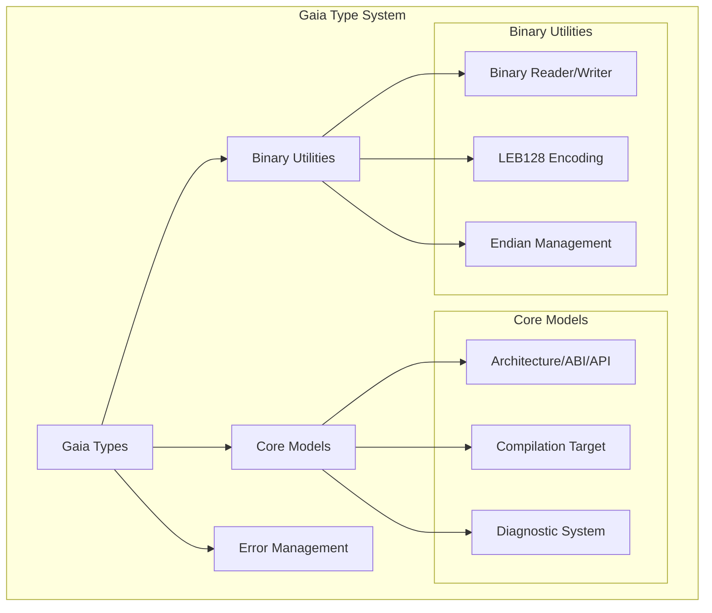

# Gaia Types

The foundational type system and binary utility library for the Gaia project, providing core abstractions for intermediate representation (IR), architecture definitions, and endian-aware binary I/O.

## 🏛️ Architecture



## 🚀 Features

### Core Capabilities
- **Architecture Abstraction**: Unified definitions for CPU architectures (X86, ARM, RISC-V), ABIs (SystemV, Win64), and platform APIs (Vulkan, Metal, Win32).
- **Endian-Aware I/O**: High-performance `BinaryReader` and `BinaryWriter` supporting both Little-Endian and Big-Endian data processing.
- **Structured Error Model**: A comprehensive `GaiaError` type with support for source location tracking, diagnostic levels, and specialized error categories (IO, Parse, Backend).

### Advanced Features
- **Variable-Length Encoding**: Optimized implementation of LEB128 (Little Endian Base 128) for compact integer storage in binary formats like DWARF and WebAssembly.
- **Diagnostic Framework**: Rich diagnostic reporting with `Diagnostic` and `SourceLocation` types, compatible with IDE-style error highlighting.
- **Zero-Copy Primitives**: (🚧) Support for memory-mapped binary parsing and zero-copy data structures to maximize throughput.

## 💻 Usage

### Endian-Aware Binary Writing
The following example demonstrates how to use `BinaryWriter` to encode structured data with specific endianness.

```rust
use gaia_types::helpers::{BinaryWriter, Endian};
use std::io::Cursor;

fn main() {
    let mut buffer = Vec::new();
    let mut writer = BinaryWriter::new(&mut buffer, Endian::Little);

    // Write different types with automatic endian conversion
    writer.write_u32(0x12345678).unwrap();
    writer.write_u16(0xABCD).unwrap();
    
    // Switch endianness on the fly
    writer.set_endian(Endian::Big);
    writer.write_u32(0x12345678).unwrap();

    println!("Encoded bytes: {:02X?}", buffer);
}
```

### Using Architecture Definitions
```rust
use gaia_types::helpers::{Architecture, AbiCompatible, ApiCompatible, CompilationTarget};

fn main() {
    let target = CompilationTarget {
        build: Architecture::X86_64,
        host: AbiCompatible::SystemV,
        target: ApiCompatible::Linux,
    };
    
    println!("Targeting: {}", target);
}
```

## 🛠️ Support Status

| Category | Feature | Status |
| :--- | :--- | :---: |
| **Binary I/O** | Little/Big Endian | ✅ Full |
| **Binary I/O** | LEB128 (Signed/Unsigned) | ✅ Full |
| **Models** | Architecture Definitions | ✅ Full |
| **Models** | ABI / API Compatibility | ✅ Full |
| **Diagnostics** | Source Tracking | ✅ Full |
| **Performance** | Zero-copy Parsing | 🚧 In Progress |

*Legend: ✅ Supported, 🚧 In Progress, ❌ Not Supported*

## 🔗 Relations

- **[gaia-assembler](../gaia-assembler/readme.md)**: Provides the type definitions for the assembler's IR and backend configuration.
- **[gaia-jit](../gaia-jit/readme.md)**: Supplies the diagnostic and error handling infrastructure for the runtime compiler.
- **All Examples**: Every assembler example (e.g., `pe-assembler`, `wasi-assembler`) depends on `gaia-types` for its binary encoding and architectural modeling needs.
