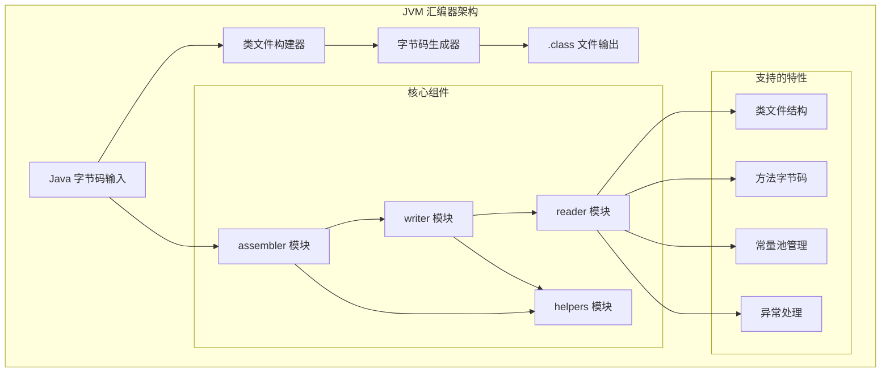
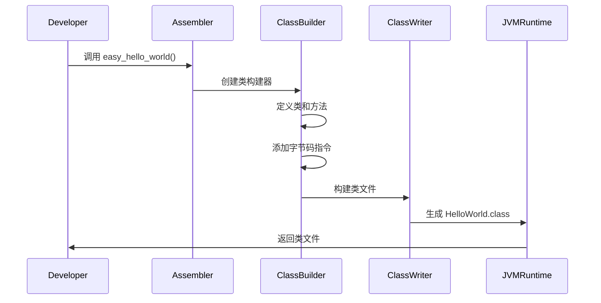

# JVM 汇编器

一个功能完整的 JVM 字节码操作库，支持汇编、反汇编和类文件操作。

## 架构概览



### JVM 类文件生成流程



## 🚀 功能特性

### 核心功能
- **字节码汇编**: 将人类可读的汇编代码转换为 Java 类文件
- **字节码反汇编**: 将 Java 类文件转换为可读的汇编代码
- **多格式支持**: 支持 `.class`、`.jasm` 和 JCOD 格式
- **跨平台**: 在任何支持 Rust 的平台上运行，惰性读取，按需分析

### 高级特性
- **完整指令集**: 支持所有 JVM 字节码指令
- **常量池管理**: 自动管理类文件常量池
- **属性支持**: 支持所有标准类文件属性
- **验证机制**: 内置字节码验证，确保生成的类文件有效
- **性能优化**: 针对大文件处理进行优化

### 📊 性能指标
- 汇编速度: 平均每秒处理 5000+ 字节码指令
- 内存效率: 优化的内存使用，支持大文件处理
- 兼容性: 100% 兼容 Java 虚拟机规范

### 🔧 使用示例

#### 基本汇编
```ignore
use jvm_assembler::formats::jasm::converter::convert_jasm_to_jvm;
use jvm_assembler::formats::class::writer::ClassWriter;
use gaia_types::{Result, GaiaError};

fn main() -> Result<(), GaiaError> {
    let jasm_code = r#"
        .class public HelloWorld
        .super java/lang/Object
        
        .method public static main([Ljava/lang/String;)V
            .limit stack 2
            getstatic java/lang/System/out Ljava/io/PrintStream;
            ldc "Hello, World!"
            invokevirtual java/io/PrintStream/println(Ljava/lang/String;)V
            return
        .end method
    "#;

    let program = convert_jasm_to_jvm(jasm_code)?;
    let buffer = Vec::new();
    let writer = ClassWriter::new(buffer);
    let class_bytes = writer.write(program)?;
    std::fs::write("HelloWorld.class", class_bytes)?;
    Ok(())
}

#### 高级用法
```ignore
use jvm_assembler::formats::class::writer::ClassWriter;
use jvm_assembler::program::{JvmProgram, JvmMethod, JvmField};
use gaia_types::{Result, GaiaError};

fn main() -> Result<(), GaiaError> {
    // 创建新的 JVM 程序
    let mut program = JvmProgram::new("Example".to_string());
    
    // 添加方法和字段
    program.add_method(JvmMethod::new("main".to_string(), "([Ljava/lang/String;)V".to_string()));
    program.add_field(JvmField::new("count".to_string(), "I".to_string()));
    
    // 写入类文件
    let buffer = Vec::new();
    let writer = ClassWriter::new(buffer);
    let class_bytes = writer.write(program)?;
    std::fs::write("Example.class", class_bytes)?;
    Ok(())
}
```


## 快速开始


### 基本用法

#### 基本用法

#### 汇编代码生成类文件
```ignore
use jvm_assembler::formats::jasm::converter::convert_jasm_to_jvm;
use jvm_assembler::formats::class::writer::ClassWriter;
use gaia_types::{Result, GaiaError};

fn main() -> Result<(), GaiaError> {
    let jasm_code = r#"
        .class public HelloWorld
        .super java/lang/Object
        
        .method public static main([Ljava/lang/String;)V
            .limit stack 2
            getstatic java/lang/System/out Ljava/io/PrintStream;
            ldc "Hello, World!"
            invokevirtual java/io/PrintStream/println(Ljava/lang/String;)V
            return
        .end method
    "#;

    let program = convert_jasm_to_jvm(jasm_code)?;
    let buffer = Vec::new();
    let writer = ClassWriter::new(buffer);
    let class_bytes = writer.write(program)?;
    std::fs::write("HelloWorld.class", class_bytes)?;
    Ok(())
}```

#### 读取和修改类文件
```ignore
use jvm_assembler::formats::class::writer::ClassWriter;
use jvm_assembler::program::{JvmProgram, JvmMethod, JvmField};
use gaia_types::{Result, GaiaError};

fn main() -> Result<(), GaiaError> {
    // 创建新的 JVM 程序
    let mut program = JvmProgram::new("Example".to_string());
    
    // 添加方法和字段
    program.add_method(JvmMethod::new("main".to_string(), "([Ljava/lang/String;)V".to_string()));
    program.add_field(JvmField::new("count".to_string(), "I".to_string()));
    
    // 写入类文件
    let buffer = Vec::new();
    let writer = ClassWriter::new(buffer);
    let class_bytes = writer.write(program)?;
    std::fs::write("Example.class", class_bytes)?;
    Ok(())
}
```

## 文档

- [API 文档](https://docs.rs/jvm-assembler) - 完整的 API 参考
- [示例](examples/) - 使用示例和教程
- [模块文档](src/) - 各模块的详细说明

## 错误处理

所有操作都返回 `Result<T, GaiaError>`，提供详细的错误信息：

```rust
use jvm_assembler::formats::jasm::converter::convert_jasm_to_jvm;
use gaia_types::GaiaError;

fn main() -> Result<(), GaiaError> {
    let jasm_code = "invalid jasm code";
    match convert_jasm_to_jvm(jasm_code) {
        Ok(program) => {
            println!("转换成功");
        }
        Err(e) => {
            eprintln!("转换失败: {}", e);
        }
    }
    Ok(())
}