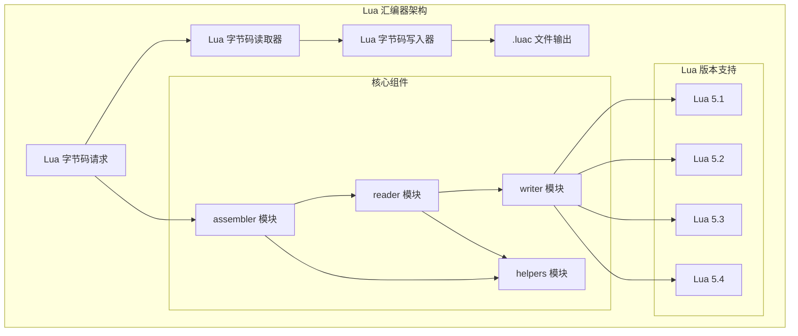
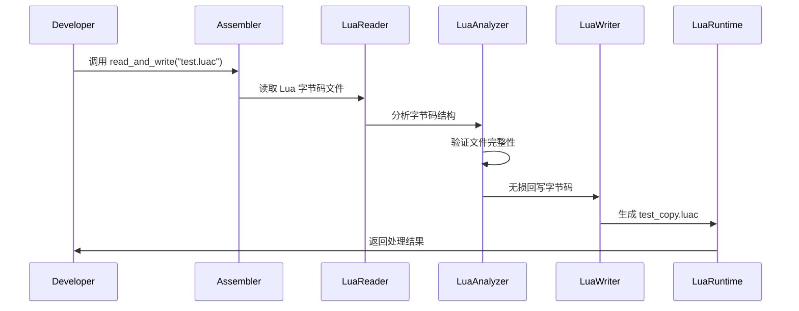

# lua-assembler

用于读取/写入 Lua `.luac` 字节码文件的 Rust 实现。

## 架构概览



### Lua 字节码处理流程



## 功能

- 读取 `.luac` 文件：解析文件头（魔数、版本信息等）并保留字节码主体
- 写入 `.luac` 文件：按原样写回头与主体，实现无损回写
- 命令行工具：支持 `lua-assembler <in.luac> <out.luac>` 进行回写验证

## 快速开始

### 构建

```bash
cargo build -p lua-assembler
```

### 生成示例 .luac（需要已安装 Lua）

```bash
# 创建测试 Lua 源文件
mkdir -p tests/luac_src
echo 'print("hello from luac")' > tests/luac_src/hello.lua

# 编译为字节码
luac -o tests/luac_src/hello.luac tests/luac_src/hello.lua
```

### 回写并执行验证

```bash,no_run
cargo run -p lua-assembler -- tests/luac_src/hello.luac tests/luac_src/out.luac
lua tests/luac_src/out.luac
# 预期输出：hello from luac
```

## API 示例

```rust,no_run
use std::path::Path;
use lua_assembler::formats::luac::{read_luac_file, write_luac_file};

let luac = read_luac_file(Path::new("tests/luac_src/hello.luac")).unwrap();
write_luac_file(Path::new("tests/luac_src/out.luac"), &luac).unwrap();
# Ok::<(), Box<dyn std::error::Error>>(())
```

## 说明

`.luac` 主体为 Lua 的字节码序列化数据，本库当前不完全解析主体，仅做基本的头部验证与无损读写；这足以用于执行验证与后续扩展。