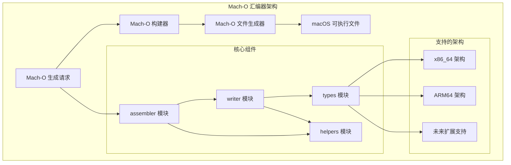
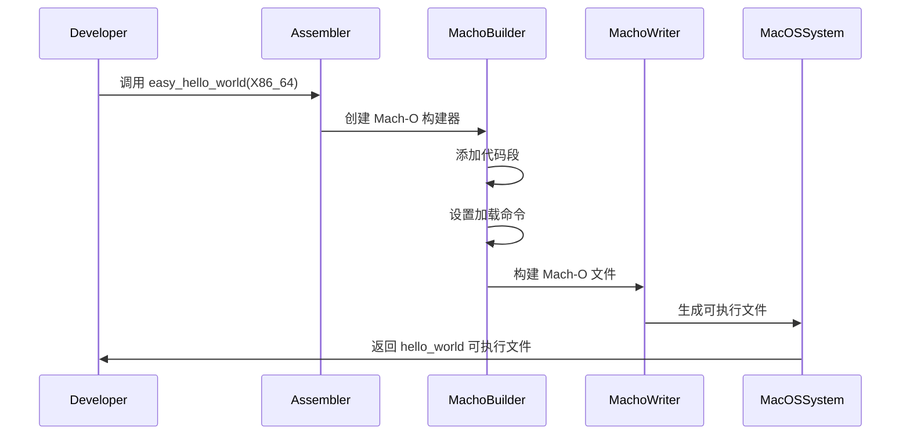

# Mach-O Assembler

支持 x64 和 ARM64 指令集的现代 Mach-O 汇编器 - 强类型、面向对象、零依赖核心

## 架构概览



### Mach-O 生成流程



## 特性

- 🚀 **高性能**: 零依赖核心，优化的二进制读写
- 🔧 **强类型**: 完整的 Rust 类型系统支持
- 📱 **多架构**: 支持 x86_64 和 ARM64 架构
- 🔍 **延迟加载**: 支持按需读取 Mach-O 文件内容
- 📊 **结构化**: 面向对象的 API 设计
- 🛡️ **安全**: 内存安全的 Rust 实现

## 支持的格式

- Mach-O 可执行文件
- Mach-O 动态库 (.dylib)
- Mach-O 静态库 (.a)
- Mach-O 目标文件 (.o)

## 快速开始

```rust
use macho_assembler::*;

// 读取 Mach-O 文件
let config = MachoReadConfig::default();
let reader = config.as_reader(file)?;
let program = reader.read()?;

// 写入 Mach-O 文件
macho_write_path(&program, "output.dylib")?;
```

## 架构支持

- **x86_64**: Intel/AMD 64位处理器
- **ARM64**: Apple Silicon (M1/M2/M3) 处理器