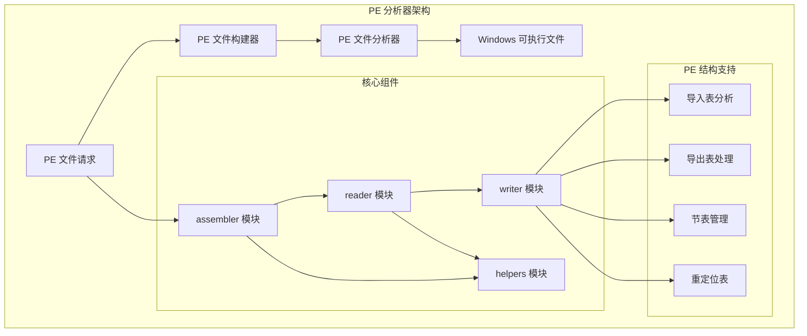
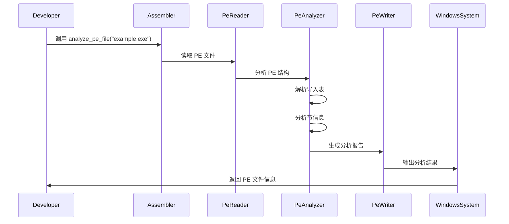

# PE 分析器 - DLL 分析工具

一个用 Rust 编写的综合 PE（可移植可执行文件）分析器，可以分析 Windows DLL 文件和可执行文件。
该工具提供有关 PE 文件结构、节区、导入、导出和调试信息的详细信息。

## 架构概览



### PE 文件处理流程



## 特性

- **PE 文件验证**: 验证 PE 文件结构，包括 DOS 头、NT 头和 COFF 头
- **架构检测**: 识别目标架构（x86、x64）
- **子系统分析**: 确定 Windows 子系统类型（GUI、控制台等）
- **节区分析**: 解析并显示所有 PE 节区的详细信息
- **导入表分析**: 列出所有导入的 DLL 和函数
- **导出表分析**: 显示 DLL 中的导出函数
- **调试信息**: 提取调试目录信息
- **可配置解析**: 控制解析 PE 文件的哪些部分


### 基本示例

```rust,ignore
use pe_assembler::reader::{PeReader, PeView};
use pe_assembler::types::ReadConfig;

fn main() -> Result<(), Box<dyn std::error::Error>> {
    // 配置 PE 读取器
    let config = ReadConfig {
        include_sections: true,
        validate_checksum: false,
        parse_imports: true,
        parse_exports: true,
    };

    // 创建 PE 读取器
    let reader = PeReader::with_config(config);
    
    // 演示 PE 读取器的配置
    println!("PE 读取器已配置");
    println!("包含节区: {}", config.include_sections);
    println!("验证校验和: {}", config.validate_checksum);
    println!("解析导入: {}", config.parse_imports);
    println!("解析导出: {}", config.parse_exports);
    
    Ok(())
}
```

### 读取 PE 头

```rust,ignore
use pe_assembler::reader::PeReader;

fn main() -> Result<(), Box<dyn std::error::Error>> {
    // 创建 PE 读取器
    let reader = PeReader::new();
    
    // 演示 PE 读取器的使用
    println!("PE 读取器已创建");
    println!("可以使用 reader.view_file() 或 reader.read_file() 来处理 PE 文件");
    
    Ok(())
}
```

### 写入简单的 PE 文件

```rust
fn main() -> Result<(), Box<dyn std::error::Error>> {
    // 创建示例 PE 数据
    let pe_data = vec![0u8; 1024]; // 示例数据
    
    // 模拟写入操作
    println!("创建的 PE 数据长度: {}", pe_data.len());
    
    Ok(())
}
```

## 功能特性

- **安全的 Rust API**: 内存安全的操作和适当的错误处理
- **PE 格式兼容**: 完全支持 PE/COFF 文件格式
- **可扩展**: 模块化设计，便于扩展
- **跨平台**: 适用于所有 Rust 支持的平台
- **零拷贝解析**: 读取 PE 文件时高效的内存使用
- **错误处理**: 全面的错误类型和消息

## API 参考

### 读取器模块

`reader` 模块提供了解析 PE 文件的函数：

- `read(data: &[u8]) -> Result<PeInfo, PeError>`: 解析 PE 文件数据
- `read_file(path: &str) -> Result<PeInfo, PeError>`: 读取并解析 PE 文件

### 写入器模块

`writer` 模块提供了生成 PE 文件的函数：

- `write(pe_info: &PeInfo) -> Result<Vec<u8>, PeError>`: 生成 PE 文件数据
- `write_file(path: &str, pe_info: &PeInfo) -> Result<(), PeError>`: 将 PE 文件写入磁盘

### 数据结构

主要数据结构包括：

- `PeInfo`: 完整的 PE 文件表示
- `DosHeader`: DOS 头结构
- `NtHeaders`: NT 头结构
- `CoffHeader`: COFF 头结构
- `OptionalHeader`: 可选头结构
- `SectionHeader`: 节区头结构
- `PeError`: PE 操作错误类型

## 开发

### 构建

```bash
cargo build
```

### 测试

```bash
cargo test
```

### 文档

```bash
cargo doc --open
```

### 代码格式化

```bash
cargo fmt
```

### 代码检查

```bash
cargo clippy
```

## 集成

该库设计用于：

- **pe-wasm32**: 用于浏览器使用的 WebAssembly 绑定
- **il-rust**: 中间语言汇编库
- **CLI 工具**: 命令行 PE 汇编实用程序
- **其他应用程序**: 任何需要 PE 文件操作的 Rust 项目

## 示例

查看 `examples` 目录获取更详细的使用示例：

- `read_pe.rs`: 演示读取和显示 PE 文件信息
- `write_pe.rs`: 显示如何创建简单的 PE 文件
- `modify_pe.rs`: 修改现有 PE 文件的示例

## 许可证

详见根目录的 [License.md](../../License.md)。

## 贡献

欢迎贡献！请随时提交拉取请求。

## 路线图

- [ ] 添加对更多 PE 文件特性的支持（资源、调试信息等）
- [ ] 改进错误处理和报告
- [ ] 添加更全面的测试覆盖
- [ ] 开发性能基准测试
- [ ] 创建更详细的示例和教程

## 导入表兼容模式（x64）

为提升在不同加载器/环境下的兼容性，写入导入表时采用“兼容模式”策略：

- x64：`OriginalFirstThunk`（INT）指向名称指针数组，`FirstThunk`（IAT）初始填入对应 `IMAGE_IMPORT_BY_NAME` 的 RVA（指向 Hint+Name）。加载器解析后会将 IAT 条目覆盖为实际函数地址。
- x86：沿用常见布局，`OriginalFirstThunk` 设为 0，`FirstThunk`（IAT）初始填入 `IMAGE_IMPORT_BY_NAME` 的 RVA。
- 目的：避免 IAT 初始为 0 时，某些加载路径不解析 INT 导致的未填充问题；统一行为让两种路径都能成功解析。

实现位置与说明：

- 写入逻辑位于 `helpers/pe_writer/mod.rs::write_import_table`，根据 `pointer_size` 在 x64 下为 IAT 写入名称 RVA；x86 维持既有行为。
- 构建器在 `helpers/builder/mod.rs` 中明确注释了该“兼容模式”，同时可选头会填写 Import Directory（索引 1）与 IAT Directory（索引 12），便于加载器识别范围。
- 示例与测试：`tests/runnable/exit_code.rs` 提供最小调用示例；新增的 x64-only 导入表测试断言 IAT 非零且指向有效 `IMAGE_IMPORT_BY_NAME`。

注意事项：

- 样例程序会清除 `DllCharacteristics` 的 `DYNAMIC_BASE` 位以禁用 ASLR，配合基于 RVA 的修补与 RIP 相对位移计算，确保加载稳定。
- 加载完成后 IAT 条目必然被覆盖为真实地址，因此初始写入的名称 RVA 仅用于解析阶段，不影响最终调用。