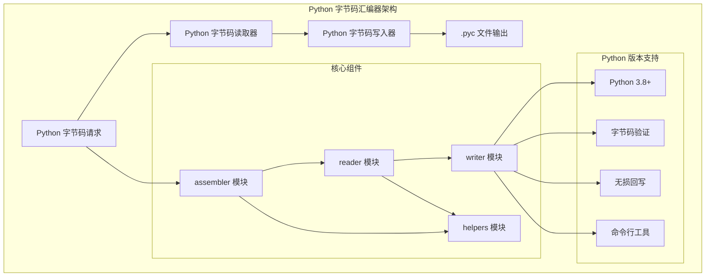
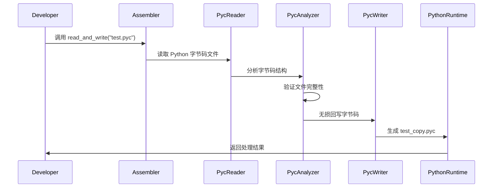

# Python 字节码汇编器

一个用 Rust 编写的 Python 字节码汇编器，用于读取和写入 Python 编译后的字节码文件。
该工具提供高性能的 Python 字节码处理能力，支持 .pyc 文件操作。

## 架构概览



### Python 字节码处理流程



## 功能

- **读取 `.pyc` 文件**：解析 `.pyc` 文件的 16 字节头部（遵循 PEP 552 规范），并保留其主体内容。
- **写入 `.pyc` 文件**：能够将读取的头部和主体内容按原样写回，实现 `.pyc` 文件的无损往返（round-trip）操作。
- **命令行工具**：提供一个简单的命令行界面，支持 `pyc-assembler <in.pyc> <out.pyc>` 命令，用于验证 `.pyc` 文件的读写功能。

## 快速开始

### 构建项目

要构建 `pyc-assembler` 项目，请确保您已安装 Rust 编程语言及其工具链。然后，在项目根目录下运行以下命令：

```bash
cargo build -p pyc-assembler
```

### 生成示例 `.pyc` 文件（需要安装 Python）

为了测试 `pyc-assembler` 的功能，您可以首先生成一个示例 `.pyc` 文件。请确保您的系统上安装了 Python。在命令行中执行以下操作：

```bash
python - <<'PY'
import py_compile, pathlib
p = pathlib.Path('tests/pyc_src')
p.mkdir(parents=True, exist_ok=True)
(p/'hello.py').write_text('print("hello from pyc")\n')
py_compile.compile(str(p/'hello.py'), cfile=str(p/'hello.pyc'))
print('OK')
PY
```

这将在 `tests/pyc_src/` 目录下创建一个 `hello.pyc` 文件。

### 无损回写并执行验证

使用 `pyc-assembler` 对生成的 `hello.pyc` 文件进行无损回写，并验证其功能：

```bash
cargo run -p pyc-assembler -- tests/pyc_src/hello.pyc tests/pyc_src/out.pyc
python tests/pyc_src/out.pyc
# 预期输出：hello from pyc
```

如果一切正常，您将看到 `hello from pyc` 的输出，这表明 `pyc-assembler` 成功地读取并写回了 `.pyc` 文件，并且生成的文件仍然可以被 Python 解释器执行。

## 说明

`.pyc` 文件的主要内容是 Python 的 `marshal` 模块序列化的 `code object`。本库当前主要关注于 `.pyc` 文件的头部解析和整体的无损读写。虽然目前不深入解析 `code object` 的内部结构，但这种无损读写能力足以用于执行验证和为未来的高级功能扩展（如字节码反汇编、修改和重新汇编）提供坚实的基础。