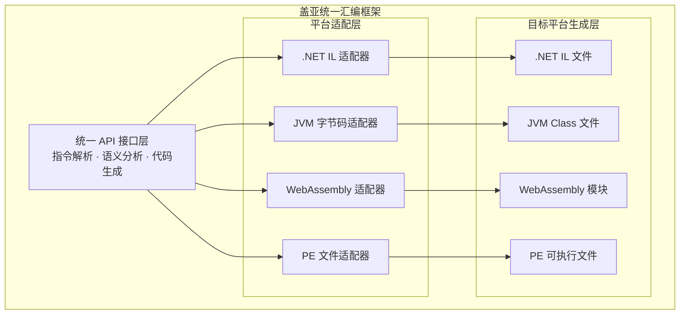
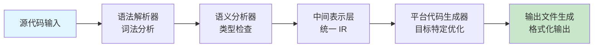
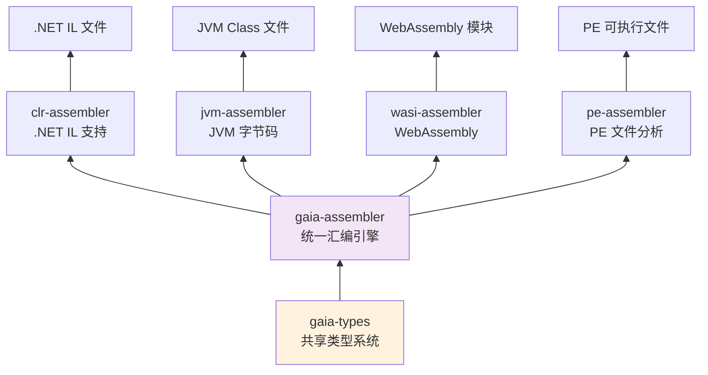
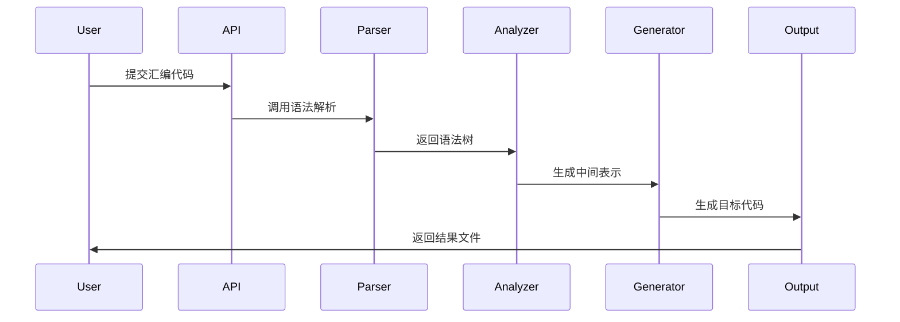

# 盖亚计划 - 统一汇编框架

> 支持 .NET IL、JVM 字节码、WebAssembly 和 PE 可执行文件的综合性多平台汇编框架

## 项目概述

盖亚计划是一个统一的汇编框架，旨在为不同平台特定的汇编语言提供通用的基础架构。采用 Rust 语言构建，兼顾性能与安全性，为多种目标平台提供一致的
API 接口。

## 核心特性

### 多平台支持

- **.NET IL 汇编器** - 生成和分析 .NET 中间语言
- **JVM 字节码汇编器** - 创建和操作 Java 虚拟机字节码
- **WebAssembly (WASI)** - 构建支持 WASI 的 WebAssembly 模块
- **PE 分析器** - 解析和分析 Windows 可移植可执行文件

### 核心组件

- **gaia-assembler** - 统一汇编引擎，提供平台无关的接口
- **gaia-types** - 共享类型系统和数据结构
- **gaia-document** - 文档生成和分析工具

## 系统架构

### 整体架构图



### 工作流程图



### 模块依赖关系图



### 数据处理流程图



## 项目结构

```
project-gaia/
├── projects/
│   ├── gaia-assembler/     # 统一汇编引擎核心
│   ├── gaia-types/        # 共享类型系统
│   ├── gaia-document/     # 文档生成工具
│   ├── clr-assembler/     # .NET IL 特定实现
│   ├── jvm-assembler/     # JVM 字节码特定实现
│   ├── wasi-assembler/    # WebAssembly 特定实现
│   └── pe-assembler/      # PE 分析工具
├── Cargo.toml            # 工作空间配置
└── README.md             # 项目文档
```

## 开发状态

| 组件             | 状态     | 版本    | 说明                |
|----------------|--------|-------|-------------------|
| gaia-assembler | ✅ 稳定版  | 0.1.0 | 核心引擎已完成           |
| gaia-types     | ✅ 稳定版  | 0.1.0 | 类型系统已完善           |
| clr-assembler  | 🚧 测试版 | 0.1.0 | .NET IL 支持基本完整    |
| jvm-assembler  | 🚧 测试版 | 0.1.0 | JVM 字节码生成功能待完善    |
| wasi-assembler | 📝 规划中 | -     | WebAssembly 支持开发中 |
| pe-assembler   | 📝 规划中 | -     | PE 文件分析功能待开发      |

## 核心优势

### 🚀 高性能

基于 Rust 语言构建，充分利用零成本抽象和内存安全特性，确保框架运行效率

### 🔧 模块化设计

清晰的模块划分，各平台实现相互独立，便于维护和扩展

### 🛡️ 类型安全

强类型系统保证代码质量，在编译期捕获潜在错误

### 📦 生产就绪

经过严格测试，提供稳定可靠的 API 接口，适用于生产环境

## 应用场景

### 编译器开发

为新型编程语言提供多平台目标代码生成能力

### 代码分析工具

构建跨平台的字节码分析和优化工具

### 教学研究

作为编译原理和虚拟机技术的教学实践平台

### 运行时开发

为自定义运行时提供底层汇编支持

## 技术特色

### 统一中间表示

所有平台通过统一的中间表示进行转换，保证语义一致性

### 智能代码优化

针对不同平台特性进行专门的代码优化

### 可扩展架构

易于添加新的目标平台支持

### 完整工具链

提供从解析到生成的完整工具链支持

## 发展路线图

### 第一阶段（当前）

- [x] 统一汇编引擎核心
- [x] 基础类型系统
- [x] .NET IL 基本支持
- [x] JVM 字节码基础功能

### 第二阶段（开发中）

- [ ] WebAssembly 完整支持
- [ ] PE 文件分析功能
- [ ] 高级优化特性
- [ ] 性能调优工具

### 第三阶段（规划中）

- [ ] x86-64 原生代码生成
- [ ] ARM64 汇编支持
- [ ] LLVM IR 集成
- [ ] 可视化调试工具

### 第四阶段（远景）

- [ ] IDE 扩展插件
- [ ] 云端编译服务
- [ ] 机器学习优化
- [ ] 图形化界面

## 贡献指南

我们欢迎各种形式的贡献，包括但不限于：

- **功能开发** - 参与新功能的设计和实现
- **文档完善** - 改进项目文档和教程
- **问题反馈** - 报告使用过程中遇到的问题
- **性能优化** - 帮助提升框架运行效率
- **平台扩展** - 添加新的目标平台支持

## 许可证

本项目采用 MIT 许可证 - 详见 [LICENSE](LICENSE) 文件

## 联系我们

- **问题反馈**：[GitHub Issues](https://github.com/nyar-vm/project-gaia/issues)
- **技术讨论**：[GitHub Discussions](https://github.com/nyar-vm/project-gaia/discussions)
- **邮件联系**：project-gaia@nyar-vm.com

---

**盖亚计划 - 连接不同平台，统一汇编世界**