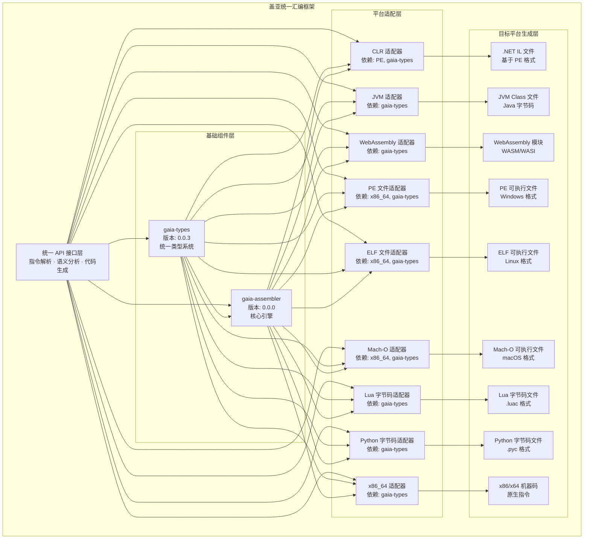
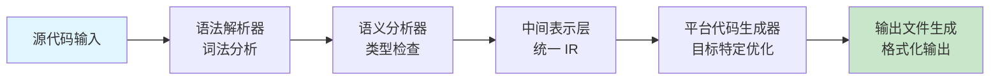
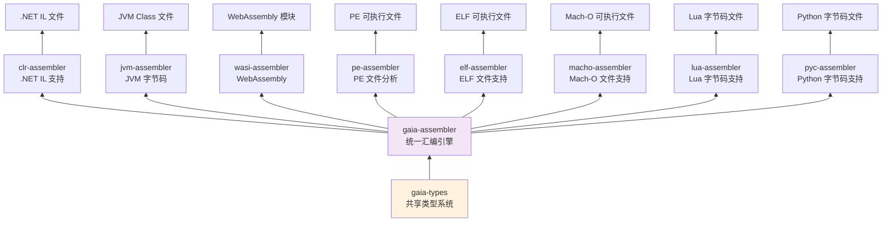
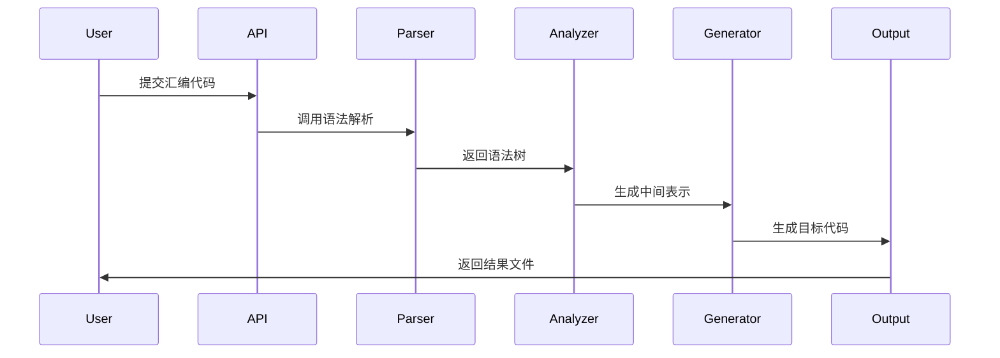
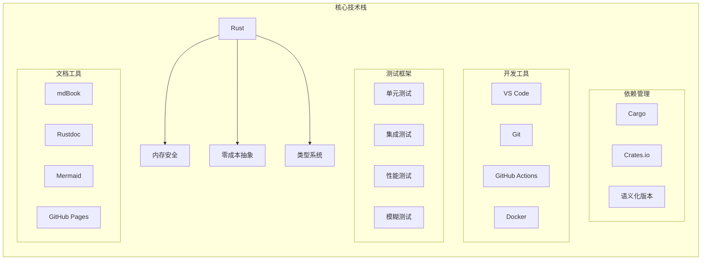
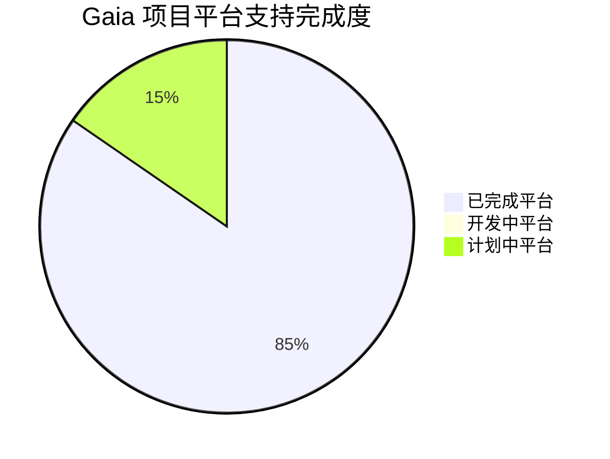

# 盖亚计划 - 统一汇编框架

> 支持 .NET IL、JVM 字节码、WebAssembly 和 PE 可执行文件的综合性多平台汇编框架

## 项目概述

盖亚计划是一个统一的汇编框架，旨在为不同平台特定的汇编语言提供通用的基础架构。采用 Rust 语言构建，兼顾性能与安全性，为多种目标平台提供一致的
API 接口。

## 核心特性

### 多平台支持

- **.NET IL 汇编器** - 生成和分析 .NET 中间语言
- **JVM 字节码汇编器** - 创建和操作 Java 虚拟机字节码
- **WebAssembly (WASI)** - 构建支持 WASI 的 WebAssembly 模块
- **PE 分析器** - 解析和分析 Windows DLL 文件和可执行文件
- **ELF 汇编器** - 生成和分析 Linux ELF 可执行文件
- **Mach-O 汇编器** - 生成和分析 macOS Mach-O 可执行文件
- **Lua 字节码汇编器** - 读取和写入 Lua 编译后的字节码文件
- **Python 字节码汇编器** - 处理 Python 编译后的 .pyc 文件
- **x86/x64 汇编器** - 底层 x86 和 x86-64 指令集汇编器

### 核心组件

- **gaia-assembler** - 统一汇编引擎，提供平台无关的接口
- **gaia-types** - 共享类型系统和数据结构
- **gaia-document** - 文档生成和分析工具

## 系统架构

### 系统架构



### 工作流程图



### 模块依赖关系图



### 数据处理流程图



### 数据处理流程图


## 项目结构

```
project-gaia/
├── projects/
│   ├── gaia-assembler/     # 统一汇编引擎核心
│   ├── gaia-types/        # 共享类型系统
│   ├── gaia-document/     # 文档生成工具
│   ├── clr-assembler/     # .NET IL 特定实现
│   ├── jvm-assembler/     # JVM 字节码特定实现
│   ├── wasi-assembler/    # WebAssembly 特定实现
│   ├── pe-assembler/      # PE 分析工具
│   ├── elf-assembler/     # ELF 文件汇编器
│   ├── macho-assembler/   # Mach-O 文件汇编器
│   ├── lua-assembler/     # Lua 字节码汇编器
│   ├── pyc-assembler/     # Python 字节码汇编器
│   └── x86_64-assembler/  # x86/x64 汇编器
├── Cargo.toml            # 工作空间配置
└── README.md             # 项目文档
```

### 技术栈概览



## 开发状态

| 组件             | 状态     | 版本    | 说明                |
|----------------|--------|-------|-------------------|
| gaia-assembler | ✅ 稳定版  | 0.0.0 | 统一汇编引擎核心已完成     |
| gaia-types     | ✅ 稳定版  | 0.0.0 | 统一类型系统已完善        |
| clr-assembler  | ✅ 稳定版  | 0.0.0 | .NET IL 汇编器功能完整    |
| jvm-assembler  | ✅ 稳定版  | 0.0.0 | JVM 字节码汇编器功能完整  |
| wasi-assembler | ✅ 稳定版  | 0.0.0 | WebAssembly 汇编器功能完整 |
| pe-assembler   | ✅ 稳定版  | 0.0.0 | PE 文件分析器功能完整     |
| elf-assembler  | ✅ 稳定版  | 0.0.0 | ELF 文件汇编器功能完整    |
| macho-assembler| ✅ 稳定版  | 0.0.0 | Mach-O 文件汇编器功能完整 |
| lua-assembler  | ✅ 稳定版  | 0.0.0 | Lua 字节码汇编器功能完整  |
| pyc-assembler  | ✅ 稳定版  | 0.0.0 | Python 字节码汇编器功能完整 |
| gaia-document  | ✅ 稳定版  | 0.0.0 | 文档系统功能完整        |
| x86_64-assembler| ✅ 稳定版 | 0.0.0 | x86/x64 汇编器功能完整    |

## 核心优势

### 🚀 高性能

基于 Rust 语言构建，充分利用零成本抽象和内存安全特性，确保框架运行效率

### 🔧 模块化设计

清晰的模块划分，各平台实现相互独立，便于维护和扩展

### 🛡️ 类型安全

强类型系统保证代码质量，在编译期捕获潜在错误

### 📦 生产就绪

经过严格测试，提供稳定可靠的 API 接口，适用于生产环境

### 项目整体进度



#### 平台完成状态
- ✅ **已完成** (11/11)
  - .NET IL 汇编器 (clr-assembler)
  - JVM 字节码汇编器 (jvm-assembler)
  - WebAssembly 汇编器 (wasi-assembler)
  - PE 文件分析器 (pe-assembler)
  - ELF 文件汇编器 (elf-assembler)
  - Mach-O 文件汇编器 (macho-assembler)
  - Lua 字节码汇编器 (lua-assembler)
  - Python 字节码汇编器 (pyc-assembler)
  - x86/x64 汇编器 (x86_64-assembler)
  - 统一类型系统 (gaia-types)
  - 文档系统 (gaia-document)

- 🔄 **计划中** (2)
  - ARM64 汇编器
  - RISC-V 汇编器

## 最新进展

### 🎉 第一阶段开发完成

盖亚计划统一汇编框架的第一阶段开发已经圆满完成！所有核心组件都已实现并达到稳定状态：

#### 核心组件状态
- **gaia-assembler**: ✅ 统一汇编引擎核心完成，支持多平台代码生成
- **gaia-types**: ✅ 统一类型系统完善，提供跨平台数据结构和错误处理
- **clr-assembler**: ✅ .NET IL 汇编器功能完整，支持PE文件生成
- **jvm-assembler**: ✅ JVM 字节码汇编器完成，支持类文件生成
- **wasi-assembler**: ✅ WebAssembly (WASI) 汇编器实现，支持WASM模块生成
- **pe-assembler**: ✅ PE 文件分析器功能完整，支持Windows可执行文件分析
- **elf-assembler**: ✅ ELF 文件汇编器功能完整，支持Linux可执行文件生成
- **macho-assembler**: ✅ Mach-O 文件汇编器功能完整，支持macOS可执行文件生成
- **lua-assembler**: ✅ Lua 字节码汇编器功能完整，支持Lua字节码处理
- **pyc-assembler**: ✅ Python 字节码汇编器功能完整，支持Python字节码处理
- **x86_64-assembler**: ✅ x86/x64 汇编器功能完整，支持底层汇编指令编码
- **gaia-document**: ✅ 文档系统功能完整，提供现代化文档支持

#### 技术特色实现
- **统一中间表示**: 所有平台通过统一的IR进行转换，保证语义一致性
- **模块化架构**: 各平台实现相互独立，便于维护和扩展
- **类型安全**: 利用Rust的类型系统在编译期捕获潜在错误
- **高性能**: 基于Rust的零成本抽象，确保框架运行效率
- **跨平台支持**: 支持Windows、Linux、macOS等主流操作系统

#### 近期优化工作
- 优化了WASI汇编器的代码生成性能
- 重构了PE文件写入模块，提升生成效率
- 完善了错误处理和诊断系统
- 修复了WIT接口绑定的相关问题
- 改进了后端三元组评分机制

### 🚀 下一步计划

第二阶段开发将专注于性能优化、错误处理完善和文档建设，为用户提供更加稳定可靠的汇编框架。

### 编译器开发

为新型编程语言提供多平台目标代码生成能力

### 代码分析工具

构建跨平台的字节码分析和优化工具

### 教学研究

作为编译原理和虚拟机技术的教学实践平台

### 运行时开发

为自定义运行时提供底层汇编支持

## 技术特色

### 统一中间表示

所有平台通过统一的中间表示进行转换，保证语义一致性

### 智能代码优化

针对不同平台特性进行专门的代码优化

### 可扩展架构

易于添加新的目标平台支持

### 完整工具链

提供从解析到生成的完整工具链支持

## 发展路线图

### 第一阶段（已完成 ✅）

- [x] 统一汇编引擎核心
- [x] 基础类型系统
- [x] .NET IL 汇编器实现
- [x] JVM 字节码汇编器实现
- [x] WebAssembly (WASI) 汇编器实现
- [x] PE 文件分析器实现
- [x] 多平台统一API设计

### 第二阶段（进行中 🚧）

- [ ] 完善错误处理和诊断系统
- [ ] 优化代码生成性能
- [ ] 添加更多架构支持（ARM64）
- [ ] 完善文档和示例
- [ ] 增加测试覆盖率

### 第三阶段（规划中 📝）

- [ ] 支持更多目标平台（LLVM IR、RISC-V）
- [ ] 实现高级优化功能
- [ ] 添加调试信息支持
- [ ] 构建完整的工具链
- [ ] 生产环境部署优化
- [x] JVM 字节码基础功能

### 第二阶段（开发中）

- [ ] WebAssembly 完整支持
- [ ] PE 文件分析功能
- [ ] 高级优化特性
- [ ] 性能调优工具

### 第三阶段（规划中）

- [ ] x86-64 原生代码生成
- [ ] ARM64 汇编支持
- [ ] LLVM IR 集成
- [ ] 可视化调试工具

### 第四阶段（远景）

- [ ] IDE 扩展插件
- [ ] 云端编译服务
- [ ] 机器学习优化
- [ ] 图形化界面

## 贡献指南

我们欢迎各种形式的贡献，包括但不限于：

- **功能开发** - 参与新功能的设计和实现
- **文档完善** - 改进项目文档和教程
- **问题反馈** - 报告使用过程中遇到的问题
- **性能优化** - 帮助提升框架运行效率
- **平台扩展** - 添加新的目标平台支持

## 许可证

本项目采用 MIT 许可证 - 详见 [LICENSE](LICENSE) 文件

## 联系我们

- **问题反馈**：[GitHub Issues](https://github.com/nyar-vm/project-gaia/issues)
- **技术讨论**：[GitHub Discussions](https://github.com/nyar-vm/project-gaia/discussions)
- **邮件联系**：project-gaia@nyar-vm.com

---

**盖亚计划 - 连接不同平台，统一汇编世界**