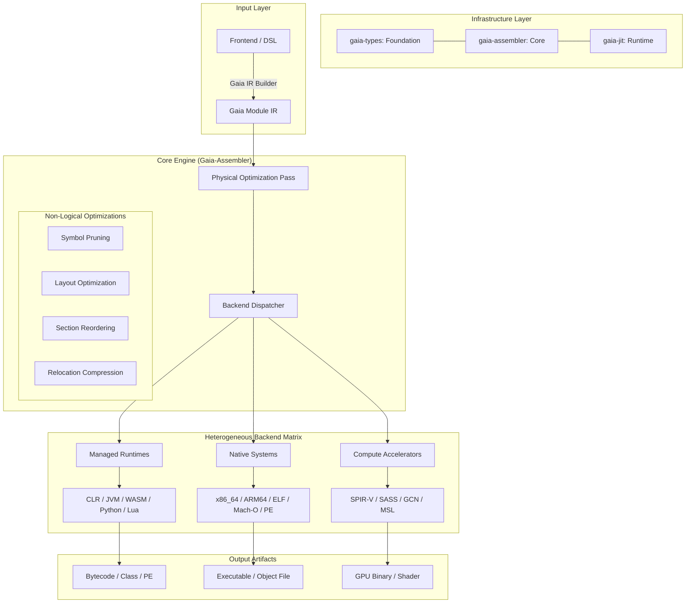

# 🌍 Project Gaia: Universal Low-Level Engineering Framework

Project Gaia is a high-performance, modular engineering framework designed for low-level assembly and instruction generation. It provides a unified, strongly-typed Intermediate Representation (IR) and an extensible backend dispatching logic for heterogeneous computing platforms, ranging from managed virtual machines to bare-metal hardware and GPU accelerators.

---

## 🏛️ System Architecture

Gaia is built on a decoupled, multi-tier architecture that ensures zero-cost abstraction and maximum extensibility. The framework is designed to handle the entire lifecycle of program generation: from high-level IR construction to optimized binary encoding.

### 🔄 The Compilation Pipeline

```mermaid
graph TB
    subgraph "Infrastructure Layer"
        GT[gaia-types: Foundation] --- GA[gaia-assembler: Core]
        GA --- GJ[gaia-jit: Runtime]
    end

    subgraph "Input Layer"
        F1[Frontend / DSL] -->|Gaia IR Builder| C1[Gaia Module IR]
    end

    subgraph "Core Engine (Gaia-Assembler)"
        C1 --> C2[Physical Optimization Pass]
        C2 --> C3[Backend Dispatcher]
        
        subgraph "Non-Logical Optimizations"
            C2a[Symbol Pruning]
            C2b[Layout Optimization]
            C2c[Section Reordering]
            C2d[Relocation Compression]
        end
    end

    subgraph "Heterogeneous Backend Matrix"
        C3 --> B1[Managed Runtimes]
        C3 --> B2[Native Systems]
        C3 --> B3[Compute Accelerators]
        
        B1 --> B1a[CLR / JVM / WASM / Python / Lua]
        B2 --> B2a[x86_64 / ARM64 / ELF / Mach-O / PE]
        B3 --> B3a[SPIR-V / SASS / GCN / MSL]
    end

    subgraph "Output Artifacts"
        B1a --> O1[Bytecode / Class / PE]
        B2a --> O2[Executable / Object File]
        B3a --> O3[GPU Binary / Shader]
    end
```

---

## 🎯 Core Design Philosophy

### 💎 Universal Instruction Set (UIS)
Gaia defines a unified instruction set based on an extended version of .NET IL. This UIS serves as a bridge between high-level semantics and low-level execution models. It abstracts away the fundamental differences between stack-based architectures (like JVM/Wasm) and register-based architectures (like x86/ARM) using a metadata-rich IR.

### ⚡ Zero-Cost Abstractions
Performance is a first-class citizen in Gaia. The framework is written in idiomatic Rust, leveraging its ownership model and compile-time checks to ensure that the IR transformation and binary generation processes introduce zero runtime overhead. All heavy lifting is performed during the assembly phase.

### 🔌 Modular Backend Protocol
The framework exposes a standardized `Backend` trait. This allows for seamless integration of new target platforms without modifying the core engine. Each backend is responsible for its own:
- **Binary Encoding**: Converting IR opcodes to target machine code.
- **Section Allocation**: Managing memory layouts for code, data, and constants.
- **Relocation Handling**: Resolving symbols and addresses across modules.

---

## 🚀 Key Features & Capabilities

### 🛠️ Engineering Excellence
- **Multi-layered Modularization**: Separated crates for core types, assembler logic, and JIT execution.
- **Type-Driven Safety**: Static prevention of illegal operand combinations and type mismatches using Rust's advanced type system.
- **Diagnostic System**: Integrated cross-platform error reporting with source location tracking and detailed diagnostics.

### 🌐 Heterogeneous Backend Matrix
- **Managed Runtimes**: Comprehensive support for industry-standard VMs including `.NET CLR`, `JVM`, `CPython`, and `Lua`.
- **Native Architectures**: Direct generation of native binaries for `x86_64` and `ARM64` with support for standard object formats like `ELF`, `Mach-O`, and `PE`.
- **Web & Cloud**: First-class `WebAssembly (WASI)` support for secure, portable, and sandboxed execution.
- **GPU & Heterogeneous Compute**: Direct-to-hardware instruction generation for `NVIDIA (SASS)`, `AMD (GCN)`, and standardized shaders via `SPIR-V` and `MSL`.

---

## 📂 Project Ecosystem

| Component | Description | Technical Path |
| :--- | :--- | :--- |
| **`gaia-types`** | Foundational type system, endian-aware I/O, and diagnostic infrastructure. | [`/projects/gaia-types`](./projects/gaia-types) |
| **`gaia-assembler`** | Core IR representation, module management, and backend orchestration. | [`/projects/gaia-assembler`](./projects/gaia-assembler) |
| **`gaia-jit`** | Secure executable memory management following W^X policies for dynamic execution. | [`/projects/gaia-jit`](./projects/gaia-jit) |
| **`examples`** | Reference implementations and deep-dives into specific backend logic. | [`/examples`](./examples) |

---

## 💻 Getting Started

The project is designed as an engineering library. For developers looking to integrate Gaia or implement a new backend, the following resources are recommended:

1.  **Exploration**: Browse the [`/examples`](./examples) directory to see how various assemblers (e.g., `pe-assembler`, `jvm-assembler`) are implemented.
2.  **Core Types**: Understand the foundational IR by examining [`gaia-types`](./projects/gaia-types).
3.  **Documentation**: Visit our VitePress-based documentation in [`/documentation`](./documentation) for high-level guides and specifications.

---

## 📜 License

Project Gaia is open-source software licensed under the **Mozilla Public License 2.0 (MPL-2.0)**. We believe in an open and collaborative ecosystem for low-level engineering tools. See [License.md](./License.md) for the full license text.

---

**Empowering the next generation of heterogeneous computing.**
